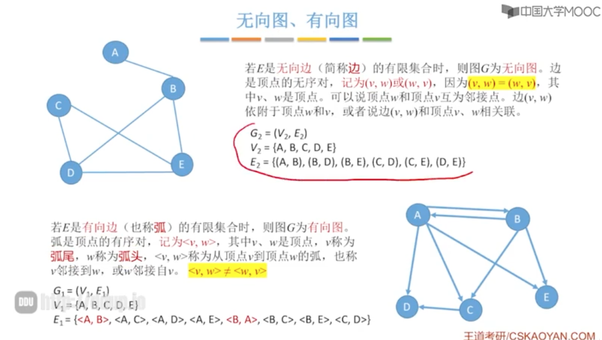
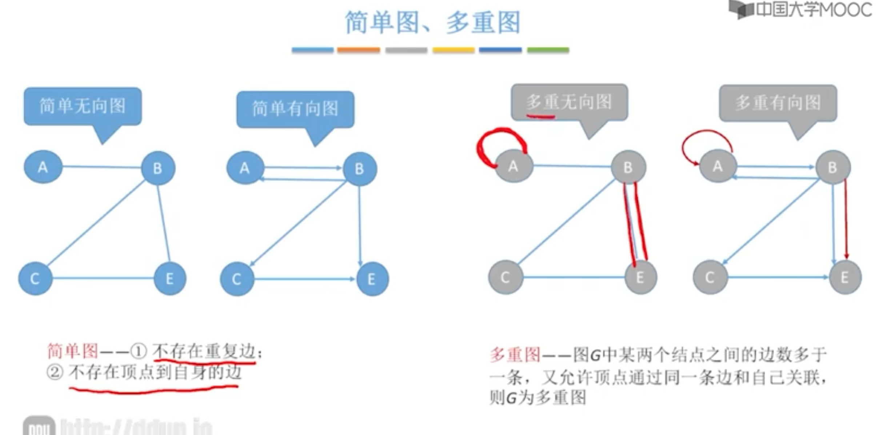
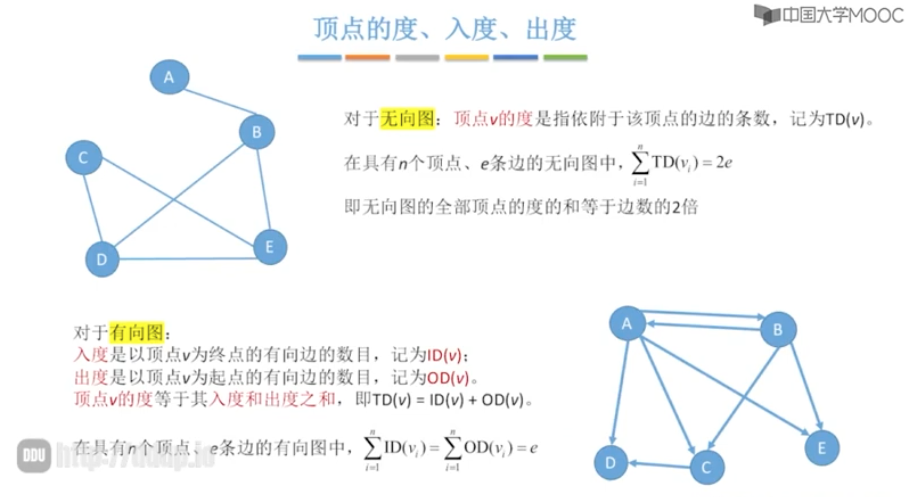
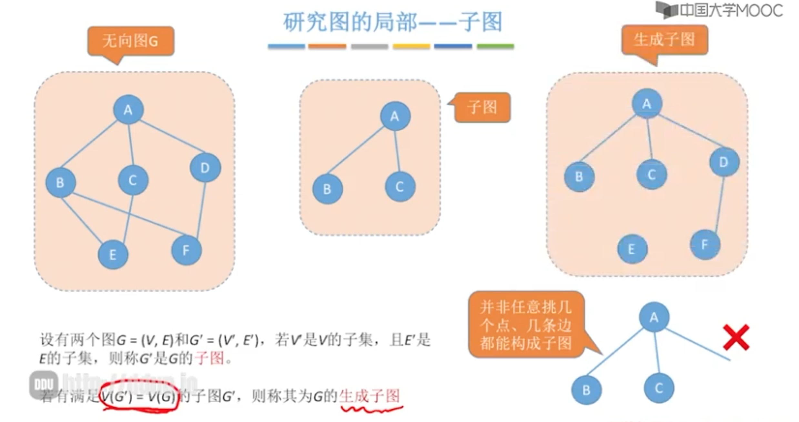
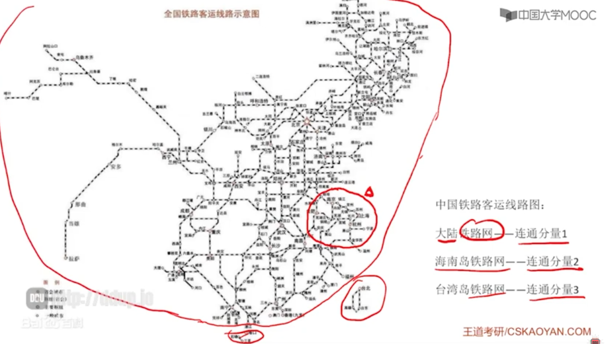
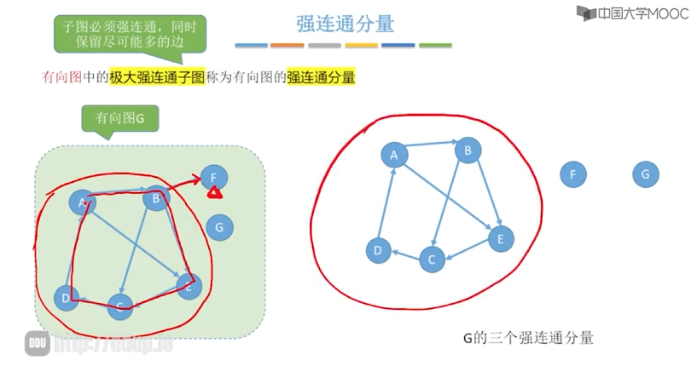
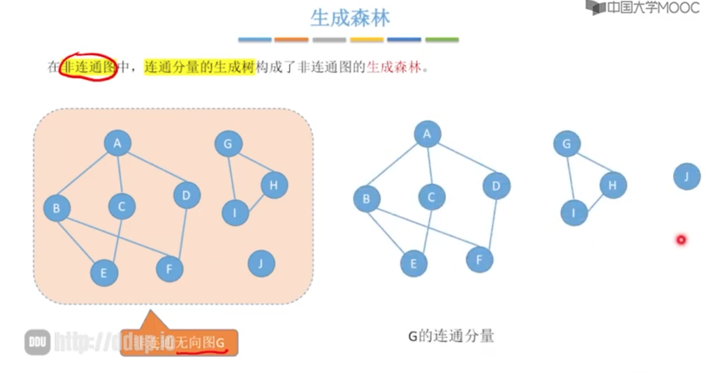
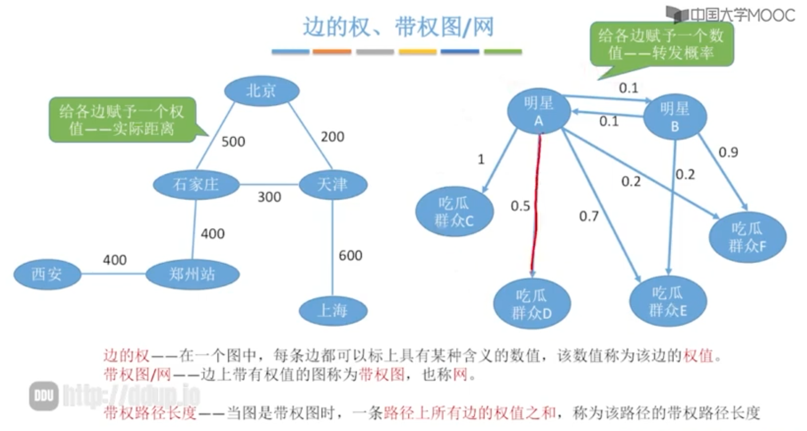
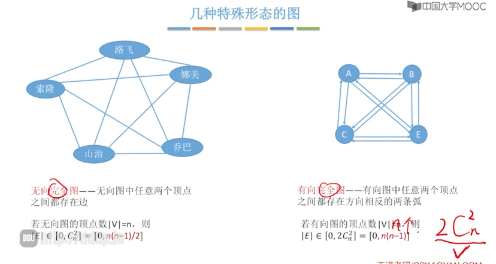
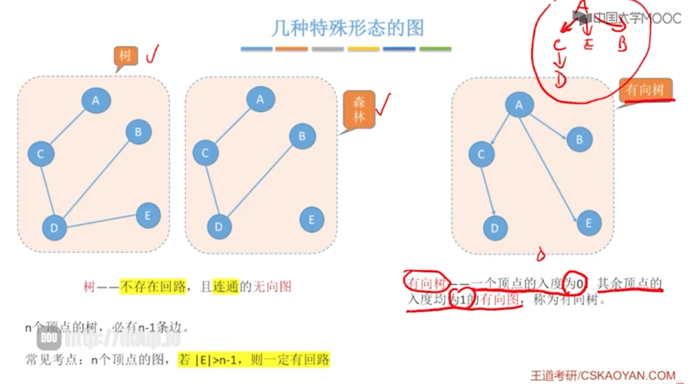

# 第六章：图

图中，一定要搞清楚图的基本术语，因为图的术语有很多。无向图和有向图都不一样。

其中掌握图的顺序存储和链式存储；图的遍历经常考，DFS、BFS；

图的应用一定要会手动的模拟，写不出算法没有关系。最小生成树、最短路径、拓扑排序、关键路径。

## 1.图的概念

### 图的定义

> 注意点：
>
> 1. 线性表可以是空表，树可以是空树，但是图不可以是空。

### 图逻辑结构应用

### 有向图、无向图

### 简单图、多重图

### 顶点的度、入度、出度

### 顶点与顶点之间关系描述

### 有向图-强连通

>无向图：
>
>若G是**连通图**，最少有 n-1 个边，最多 Cn2组合；
>
>
>
>有向图 
>
>**强连通图**：任意两个结点相互可达！

### 子图

### 无向图 - 连通分量

**1.极大； 2.连通子图**

**无向图连通分量的现实意义**

### 有向图 - 强连通分量

### 生成树 - 无向连通图

**1.连通； 2.极小**

 

### 生成森林 - 无向非连通图

 

### 边的权、带权图

 

### 无向完全图与有向完全图

 

### 稀疏图与稠密图 

 

### 树、森林、有向树

 

## 2.图的存储

### 邻接矩阵法

# 第七章：查找

查找是基于排序的，有些乱序的序列需要先排好序后再查找。其中折半查找和查找树以及散列查找，hash函数经常考。

KMP算法 明白原理即可。

# 第八章：排序

排序的算法很多，408要求主要掌握内部排序。重点搞清楚 交换排序 和选择排序，要明白各种排序的优势在哪儿和时间复杂度。

# 《数据结构》考点

### 2.4 树和二叉树

- 树和二叉树的基本概念（选）

> 1.树的性质：区分树的度和图的度
> 2.二叉树的性质：
> （1）n0 = n2 +1;
> （2）完全二叉树i结点的左孩子为2i，右孩子为2i+1 (从1开始编号)

- 二叉树的存储方式（选）

> \1. 顺序存储，其实就是按照完全二叉树来存储
> \2. 链表存储：链表的空指针数 = 结点数n + 1

- 二叉树的遍历方式（选+算）

> 四种遍历方式（先序，中序，后序，层次）
> 其中先序中序后序不仅要掌握递归方式还要掌握非递归方式，层次遍历需要借助队列来实现；**[线索二叉树](https://www.zhihu.com/search?q=线索二叉树&search_source=Entity&hybrid_search_source=Entity&hybrid_search_extra={"sourceType"%3A"article"%2C"sourceId"%3A165229143})**是在先序中序后序递归实现方式上的变形（重点）

- 二叉树的应用（选+应）

> \1. 并查集：图里面最小生成树的基础
> \2. 二叉排序树(算)：代码模板记住
> 3.平衡二叉树AVL(选)：掌握LL型、RR型、LR型、RL型的调整过程
> 3.哈夫曼树和[哈夫曼编码](https://www.zhihu.com/search?q=哈夫曼编码&search_source=Entity&hybrid_search_source=Entity&hybrid_search_extra={"sourceType"%3A"article"%2C"sourceId"%3A165229143})(选+应)：不仅会画图还要会用文字来叙述

### 2.5 图

- 图的概念（选）

> \1. 图的度与树的度的区分
> \2. [有向图](https://www.zhihu.com/search?q=有向图&search_source=Entity&hybrid_search_source=Entity&hybrid_search_extra={"sourceType"%3A"article"%2C"sourceId"%3A165229143})与无向图的区分（连通性，强连通性）
> \3. 简单路径与简单回路
> \4. 距离：最短路径

- 图的存储方式（选+应一个小问）

> \1. [邻接矩阵](https://www.zhihu.com/search?q=邻接矩阵&search_source=Entity&hybrid_search_source=Entity&hybrid_search_extra={"sourceType"%3A"article"%2C"sourceId"%3A165229143})*
> \2. 邻接表*
> \3. 十字链表(有向图)
> \4. 邻接多重表(无向图)

- 图的遍历方式（选+算）

> \1. BFS：类似二叉树的层次遍历；注意BFS的变形--求单源最短路径
> \2. DFS：类似二叉树的先序遍历；
> **3. BFS与DFS都需要借助辅助数组visited[]来标记当前结点是否被访问过**
> **4. 图的遍历与图的连通性的关系\***

- 图的应用（选+应）

> **1. 最小生成树**
> （1）prim算法
> （2）Kruskal算法
> **2. 最短路径**
> （1）dijkstra算法
> （2）Floyd算法
> **3. [拓扑排序](https://www.zhihu.com/search?q=拓扑排序&search_source=Entity&hybrid_search_source=Entity&hybrid_search_extra={"sourceType"%3A"article"%2C"sourceId"%3A165229143})：**可以用来判断图是否有环
> **4.关键路径**

### 2.6 查找

- 顺序查找（选）

> \1. 普通顺序表：进行普通的从小到大的遍历查找插入点，然后**插入**
> **2. 有序顺序表\*：**进行二分的思想进行查找插入点，然后**插入 --- 记住二分思想的核心代码**
> 以上两种方式由于都需要进行插入，故时间复杂度为O(n^2)

- 分块查找（选）

> 使用了索引表+查找表的结构：
> （1）索引表：有序表 --- 二分查找
> （2）查找表 --- 根据索引分块后采用顺序查找方式查找

- 二叉排序树、AVL树(平衡二叉树)、B树、B+树（选）

> \1. 二叉排序树上的查找
> \2. AVL树上的查找：其实就等效为二叉排序树上的查找，因为AVL树就是一颗二叉排序树
> \3. B树：
> （1）概念：包含m/2向上取整-1 <= n(非根结点) <= m-1；[叶子结点](https://www.zhihu.com/search?q=叶子结点&search_source=Entity&hybrid_search_source=Entity&hybrid_search_extra={"sourceType"%3A"article"%2C"sourceId"%3A165229143})不含数据，数据存在索引上等
> （2）B树高度求法：logm^(n+1) <= h <= logm/2向下取整^(n+1)/2 + 1
> （3）B树插入：可能使B树高度h+1
> （4）B树删除：可能使B树高度h-1
> \4. B+树
> （1）B+树的概念
> （2）B+树与B树的区别
> **（3）B+树的特点：**数据都存在叶子结点上，非终端结点只起索引作用；B+树可以有两种查询方式
> **注意：B/B+一般是以选择题的形式考察，并且考察的深度不高，我们只需要学习基本知识就可以**

- 散列表（选+应）

> \1. [散列函数](https://www.zhihu.com/search?q=散列函数&search_source=Entity&hybrid_search_source=Entity&hybrid_search_extra={"sourceType"%3A"article"%2C"sourceId"%3A165229143})：直接定址法、除留取余法是重点，其他了解即可
> \2. 处理冲突：
> （1）开放定址法：线性探测法、平方探测法、再散列法是重点
> （2）拉链法
> \3. 装填因子
> **4. 求散列表上查找成功/不成功的平均查找数\***

- KMP（选+算+应）

> KMP算法的核心是next[]数组，掌握**计算机的next[]数组，**这里说的计算机的next[]数组是相当于手动模拟的next[]数组而言的，408考察的是计算机的next[]数组
> 计算机next[] = 手动模拟的next[] **右移一位 + 1**
> **KMP算法记下来，注意KMP的特点是主串不回溯**

### 2.7 排序

- 插入排序（选）

> \1. 直接插入排序
> \2. 折半插入排序：引入二分思想
> \3. [希尔排序](https://www.zhihu.com/search?q=希尔排序&search_source=Entity&hybrid_search_source=Entity&hybrid_search_extra={"sourceType"%3A"article"%2C"sourceId"%3A165229143})

- 交换排序（选+算）

> \1. 冒泡排序
> **2. 快速排序：把Partition函数当模板记下来**

- 选择排序（选）

> \1. 简单选择排序
> \2. 堆排序：向下调整 、向上调整
> （1）堆的构建：向下调整，这里的时间复杂度为O(n)要知道为什么
> （2）堆排序：向下调整

- 归并排序（选+算）

> 掌握Merge函数，当模板记下来

- 基数排序（选+算）

> 基数排序是给予非比较的排序
> 拓展：桶排序、计数排序

- 外部排序--多路归并排序（选）

> \1. 败者树：要会自己构建败者树，败者树可以减少比较次数
> \2. 置换-选择排序：划分初试归并段
> \3. 最佳归并树：减少归并过程中的I/O次数
> **注意：虽然外部排序的内容少，但是外部排序的难度比内部排序的难度要高，幸运的是外部排序基本以选择题形式考察；学习外部排序重点是学习思想，要去真正的理解它。**

------

## 3. 经验总结

1. 在408真题中的数据结构部分的题目可以看出：选择题大多考察相应结构/算法的中间过程，这就要求我们必须深刻的理解和熟练的掌握此结构/算法，能从计算机的角度出发去思考计算机处理这个问题处理的整个过程是什么样的，而不要从个人主观上出发去看此结构/算法，因为这样只是表面上搞懂了此结构/算法，但是一做题该错的还是错，不会的还是不会；大题部分重点在于积累和做题，因为408真题中算法大题和应用大题基本上每一年考察的知识点和思想都不是很相同，所有我们需要多去做大题，虽然大题比较难做，但是一点要坚持去把王道的课后大题都做完，一边做一边去思考，慢慢的就会变好。
2. 选择题经常有很多坑，做题不要想当然，写答案前多问问自己这题真的是这样？真的这麽简单？比别人想的更多才能比别人走的更远；大题主要强调的是思想，多去想想算法大题有什么其他的解法，应用大题考的知识点是哪些，一定要做到看完题目心中有数，方能不乱阵脚。

