**参考**

[计算机/软工408考研--数据结构重难点](https://zhuanlan.zhihu.com/p/165229143)

[计算机/软工408考研---组成原理+OS重难点](https://zhuanlan.zhihu.com/p/194156185)

[计算机/软工408考研---计算机网络重难点](https://zhuanlan.zhihu.com/p/187130615)


[408数据结构——绪论&复杂度分析](https://blog.csdn.net/qq_21457395/article/details/120381958)

[冷月手撕408之数据结构(1)-导论](https://cloud.tencent.com/developer/article/1790830)

[数据结构线性表（王道随书408考研）](https://www.codeleading.com/article/21576059920/)

参考：https://juejin.cn/user/606586151647870/posts


[408数据结构之线性表 - 代码参考](https://blog.csdn.net/weixin_43903780/article/details/115175997?utm_medium=distribute.pc_relevant.none-task-blog-2~default~baidujs_title~default-0.pc_relevant_paycolumn_v2&spm=1001.2101.3001.4242.1&utm_relevant_index=3)


# 408考察方式

​		计算机基础综合408，主要通过**选择题(40题，每题2分，共80分)**和**大题(7题，每题分数不等，共70分)**进行考察，一共包含4门学科--数据结构45'、组成原理45'、操作系统35'、计算机网络25'，其中数据结构和组成原理考察的总分值较高，操作系统其次，计算机网络总分值最低。


# 《数据结构》

408真题中，数据结构考察包含如下形式和特点：

**选择题部分：**共11题22分，主要考察对数据结构的细节理解，很多题目并不是简单考察某个结构/算法的最终结果，大都考察结构/算法的中间过程。同时选择题会挖很多坑，一般感觉一眼就能看出答案的反而需要重视，一不小心就入坑。

**大题目部分：**共2题22-25分左右，2个大题分为**算法大题**和**应用大题**。其中算法大题主要考察算法思想、伪代码编写、分析时间空间复杂度，集中考察线性表和[二叉树](https://www.zhihu.com/search?q=二叉树&search_source=Entity&hybrid_search_source=Entity&hybrid_search_extra={"sourceType"%3A"article"%2C"sourceId"%3A165229143})的算法；应用大题需要结合结构/算法针对题目来解答，主要以文字+分析+图表的形式作答。


# 第一章：绪论


**存储结构**

- 顺序存储：逻辑上连续，物理上也连续
- 链式存储：逻辑上连续，物理不一定也连续
- 索引存储：建立一张索引表，搜索时先查表
- 散列存储：哈希存储


在绪论中，理解算法的评价标准。时间复杂度和空间复杂度。时间复杂度要知道怎么计算的。


## 考点1. 时间复杂度和空间复杂度

- 时间复杂度（选+算第3问）

    > 非递归函数
    >
    > 1. 利用累加/累乘法分析非递归函数的时间复杂度；
    >
    > **递归函数**
    >
    > 1. 利用Master公式分析满足T(n)=aT(n/b)+n^d的递归函数的时间复杂度，例如：快速排序；--- **Master公式适用于递归分治算法**
    > 2. 利用依次递归的方式分析普通递归函数的时间复杂度；
    > 3. 利用特例法分析非常规递归函数的时间复杂度，如：分析斐波那契数列的递归函数的时间复杂度，举特例F(5)来分析；

- [空间复杂度](https://www.zhihu.com/search?q=空间复杂度&search_source=Entity&hybrid_search_source=Entity&hybrid_search_extra={"sourceType"%3A"article"%2C"sourceId"%3A165229143})（选择题+算法大题第3问）

    > 1. 空间复杂度与时间复杂度分析大致相同，只是空间复杂度的侧重点在额外的空间上；
    > 2. **需要注意的是递归函数有递归栈这个特殊的额外空间**


# 第二章：线性表

[408数据结构——线性表](https://blog.csdn.net/qq_21457395/article/details/121326143)

**线性表(Linear List)**是具有<u>**相同数据类型**</u>的n(n>=0)个**数据元素**的**有限**序列，当表长n为0的时候，为空表。

- 除第一个元素外，每个元素有且只有一个直接前驱。
- 除最后一个元素外，每个元素有且只有一个直接后续。

**注意：线性表是一种逻辑结构，表示元素之间一对一的相邻关系。顺序表和链表是指存储结构**。两者属于不同层面的概念，因此不要混淆。


**线性表的基本操作 — 创销增删改查**

```
// 创建、销毁
InitList(&L): 初始化表，构造空的线性表L，分配内存空间。
DestroyList(&L): 销毁操作，释放线性表L所占空间。
// 增删
ListInsert(&L, i, e): 插入操作
ListDelete(&L, i, &e): 删除操作，删除表L中第i个位置元素，并用e返回删除的元素的值。
// 查
LocateElem(L, e): 按值查找
GetElem(L, i): 按位查找
// 其他
Length(L): 求表长
PrintList(L): 输出操作，按前后顺序输出表L所有元素值。
Empty(L): 判空操作，若表L为空表，则返回true，否则返回false。

【注意】传入参数的&：表示参数修改的结果需要带回来。
```

**位序**：线性表中元素的位序是从 1 开始的，而数组中的元素下标是从 0 开始的，这个非常重要，应用时需区分清楚。


线性表分为**顺序表**和**链表**。

顺序表其实就可以理解为数组。逻辑上相邻的元素物理上也相邻。

链表分为单链表、双链表、循环链表、静态链表；

重要掌握链表的分类和插入、删除方法。逻辑上相邻的元素物理不一定上也相邻。


## 2.1.顺序表

* 顺序表就是数组；
* 线性表的顺序存储；
* 是用一组地址连续的存储单元依次存储线性表中的元素；

- 逻辑上相邻的两个元素在物理位置上也相邻。


### 顺序表特点

1. 顺序表最主要的特点是**随机访问（随机存取），即通过首地址和元素序号可以在O(1)的时间内找到指定的元素。但插入和删除操作需要移动大量元素**。
2. 插入和删除操作需要移动大量元素；
3. 存储密度高，只存储数据，不存储指针；
4. 拓展容量不方便。


### 复杂度分析

* **顺序表插入操作：
    最好情况：在表尾插入，元素后移语句不执行，时间复杂度为O(1)
    最坏情况：在表头插入，元素后移语句将执行n次，时间复杂度为O(n)
    平均情况：平均时间复杂度为O(n)**

    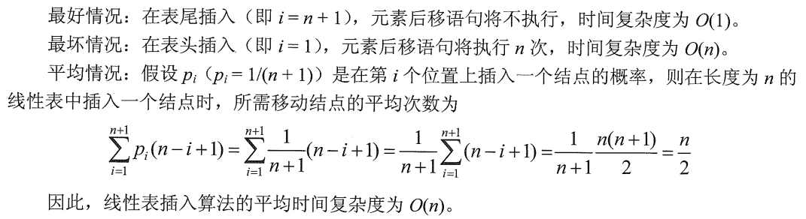

* **顺序表删除操作：
    最好情况：删除表尾元素，无需移动元素，时间复杂度为O(1)
    最坏情况：删除表头元素，需要移动除第一个元素外的所有元素，时间复杂度为O(n)
    平均情况：平均时间复杂度为O(n)**

    

* **顺序表按值查找（顺序查找）：
    最好情况：查找的元素就在表头，仅需比较一次，时间复杂度为O(1)
    最坏情况：查找的元素在表尾或不存在时，需要比较n次，时间复杂度为O(n)
    平均情况：平均时间复杂度为O(n)**

    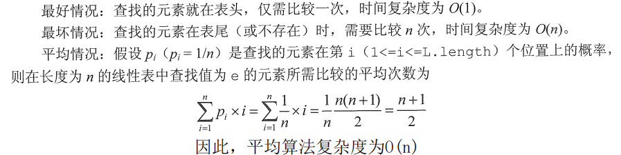


### 基本代码

```C
// 如何一个数据元素的大小？
sizeof(ElemType)
```

```C
#include <stdio.h>
#include <stdlib.h>

// 宏定义
#define MAXSIZE 10      //定义最大长度
#define ElemType int    //定义顺序表存储的类型，可自行设置

//========================== 初始化 InitList 静态数组 ==========================

// 顺序存储结构的线性表的类型
typedef struct {
    ElemType data[MAXSIZE]; //用『静态数组』存放数据元素
    int length;             //顺序表的当前长度
}SqList;                    //顺序表的类型定义（静态分配方式） Sq:Sequence 顺序、序列

// 顺序表初始化一：静态数组
SqList InitList() {
    SqList L;
    L.length = 0;
    return L;
}

// 顺序表初始化二：静态数组
// C语言中是不存在引用传参，仅仅是取地址符。所以GCC编译不过。
// 解决方案:
//      1.用指针传参代替引用传参（代码如下InitList_2_1）；
//      2.将代码保存成.cpp文件(c++中支持引用)。
void InitList_2(SqList &L) {
    for (int i = 0; i < MAXSIZE; i++) {
        L.data[i] = 0;
    }
    L.length = 0;
}

// 指针传参：静态数组
void InitList_2_1(SqList *L) {
    for (int i = 0; i < MAXSIZE; i++) {
        L->data[i] = 0;    //赋默认值，否则会有脏数据
    }
    L->length = 0;
}

//========================== 初始化 InitList 动态数组 ==========================

typedef struct{
    ElemType *data;     //动态分配数组的指针
    int maxSize;        //顺序表最大容量
    int length;         //顺序表当前长度
}SeqList;               //顺序表的类型定义（动态分配方式）

// 顺序表初始化三：动态分配数组
void InitList_3(SeqList *L) {
    L->data = (ElemType *)malloc(MAXSIZE * sizeof(ElemType));
    L->length = 0;
    L->maxSize = MAXSIZE;
}

void IncreaseSize(SeqList &L, int len) {
    ElemType *p = L.data;
    L.data = (ElemType *)malloc((L.maxSize + len) * sizeof(ElemType));
    for (int i = 0; i < L.length; i++) {
        L.data[i] = p[i];           //将数据复制到新区域
    }
    L.maxSize = L.maxSize + len;    //顺序表最大长度增加len
    free(p);                        //是否原内存空间
}

//========================== 插入 ==========================
/*	
 * 在顺序表 L LL 的第 i ii (1<=i<=L.length+1)个位置上插入新元素 e
 * 判断 i 的位置是否合法
 * 第 i 个元素及气候依次从后移动一个位置
 * 顺序表长度 加1
 */
bool ListInsert(SqList &L, int i, ElemType e) {
    if (i <= 0 || i > L.length + 1) { // 插入位置是否合法
        return false;
    }
    if (L.length >= MAXSIZE) {     // 空间是否已满
        return false;
    }
    for (int j = L.length; i >= j ; j--) {
        L.data[j] = L.data[j-1];    // 将第i个元素及之后的元素向后移动
    }
    L.data[i-1] = e;    // 在位置i处插入e
    L.length++;         // 线性表长度 +1
    return true;
}

//========================== 删除 ==========================

/*
 * 删除顺序表 L LL 中的第 i ii（1<=i<=L.length） 个位置,用引用变量 e ee 返回
 * 判断 i ii 的位置是否合法，否则返回false
 * 合法则将被删除元素赋予引用变量 e,把i+1个元素及其后的所有元素往前移动一个位置，返回true
 */
bool ListDelete(SqList &L, int i, ElemType &e) {
    if (i <= 0 || i > L.length) {
        return false;
    }

    e = L.data[i - 1];   //将被删除的元素赋予e

    for (int j = i; j < L.length; j++) {
        L.data[j - 1] = L.data[j]; 
    }
    
    L.length--;
    return true;
}

//========================== main ==========================

int main() {
    // 方式一
    SqList L1 = InitList();
  
    // 方式二
    SqList L2;          // 声明一个线性表
    InitList_2(L2);     // 初始化该线性表
    InitList_2_1(&L2);  // 初始化该线性表
    
    // 方式三
    SeqList L3;
    InitList_3(&L3);
    printf("L3最大长度为 %d a",L3.maxSize);
    // 动态扩大空间
    IncreaseSize(L3, 12);
    printf("\nL3动态增加空间后的最大长度为 %d a",L3.maxSize);
    
    return 0;
}
```


## 2.2.链表

### 单链表

**定义一个单链表**

```C
struct LNode {						// 定义单链表结点类
  	ElemType data;				// 每个节点存放一个数据元素
  	struct LNode *next;		// 指针指向下一个节点
};

//
typedef <数据类型> <别名>
// 将struct LNode 取一个别名 LNode
typedef struct LNode Lnode;  

// 单链表节点
typedef struct LNode{	//节点类型
	ElemType data;	//数据域
	Struct LNode *next;	//指针域
}LNode, *LinkList;

// 创建一个新节点，在内存中申请一个节点所需空间，并用指针p指向这个节点
struct LNode *p = (struct LNode *)malloc(sizeof(struct LNode));
// 别名写法
LNode *p = (LNode *)malloc(sizeof(LNode));
```

**表示一个单链表**

```c
// 要表示一个单链表时，只需要声明一个头指针L，指向单链表的第一个节点
LNode *L;			
LinkList L;

// 强调这是一个单链表 --- 使用LinkList
// 强调这是一个节点  	--- 使用LNode *

// eg: 获取链表的第i个节点并返回该节点
LNode * GetElem(LinkList L, int i) {
  //...
}
```

**不带头结点的单链表**

```c
typdef struct LNode {
  	ElemType data;
  	struct LNode *next;
}LNode, *LinkList;

// 初始化一个空的单链表
bool InitList(LinkList &L) {
 	L = NULL;
  	return true;
}

// 判空
bool Empty(LinkList L) {
 	return (L == NULL);
}

void test(){
  	LinkList L;		// 声明一个指向单链表的指针
  	InitList(L)   // 初始化一个空表
    Empty(L)
}
```

**带头结点的单链表【推荐】**

```c
typdef struct LNode {
  	ElemType data;
  	struct LNode *next;
}LNode, *LinkList;

bool InitList(LinkList &L) {
 	L = (LNode *)malloc(sizeof(LNode));   // 创建一个头结点
  	if (L == NULL) 
      	return false;
  	L->next = NULL;			// 头结点之后暂时还没有节点
  	return true;
}

bool Empty(LinkList L){
 	if(L->next == NULL)
     	return true;
    else
  		return false;
}

void test(){
  	LinkList L;		// 声明一个指向单链表的指针
  	InitList(L)   // 初始化一个空表
    Empty(L)
}
```

**引入头结点的好处？**

* 第1个位置的插入删除更加方便

  若使用头结点，则第1个位置的插入和删除都是对p—>next进行操作，而不用动p本身，而且减少了算法分支（即if else分支）。

  若没有头结点，在第1个位置插入或删除时，需要动头指针。

* 统一空表与非空表的处理

  若使用头结点，**无论表是否为空，头指针都指向头结点，也就是\*LNode类型**，对于空表和非空表的操作是一致的。

  若不使用头结点，**当表非空时，头指针指向第1个结点的地址，即\*LNode类型，但是对于空表，头指针指向的是NULL**，此时空表和非空表的操作是不一致的。


#### 头插法与尾插法创建单链表

> 头插法与尾插法：核心就是**初始化**操作、**指定节点的后插**操作

**头插法建立单链表**

> * 采用头插法建立单链表时，读入数据的顺序与生成的链表的元素顺序是相反的
>
> 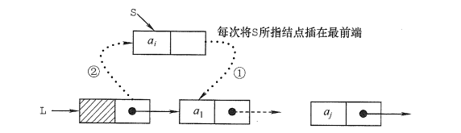
>
> - 从一个`空表`开始，通过`头插法`建立单链表的结点，以插入S所指的结点为例
>
>   ① 先将 **S** 所指结点的`next`指针，指向 **L** 所指的头结点的`next`指针,保存了**头结点**的后继结点的地址
>
>   ② 然后将**L**所指的头结点的`next`指针指向**S**所指的结点

```c
// 逆向创建单链表（带头结点）
LinkList List_HeadInsert(LinkList &L) {
 	LNode *s;
  	L = (LinkList)malloc(sizeof(LNode));   // 创建头结点
  	L->next = NULL;						// 初始化为空链表，否则会指向内存中未知内存，脏数据
  	
  	int x;
  	scanf("%d", &x);
  	while(x!=9999) {
     		s = (LNode *)malloc(sizeof(LNode));   // 创建新结点
      	s->data = NULL;
      	s->next = L->next;
      	L->next = s;						// 将新结点插入表中，L为头指针
      	scanf("%d", &x);
    }
  	return L;
}
```

> 每个结点的插入时间为 O ( 1 )  ，设单链表长为 n ，则总时间复杂度为 O ( n ) 

##### 头插法的应用

**单链表的逆置（1.原地逆置；2.新建逆置）**

// TODO

**尾插法建立单链表**

> * 采用尾插法建立单链表时，读入数据的顺序与生成的链表的元素顺序是相同的
>
> 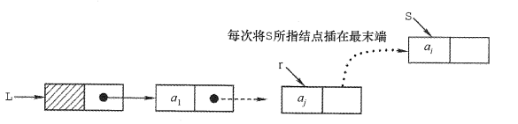
>
> * 从一个空表开始，通过尾插法建立单链表的结点，以插入S所指的结点为例
>   ①为了将新结点每次都插入当前链表的表尾，需要增加一个尾指针r,一开始在头结点，最后始终会指向链表的尾结点
>   ② 然后将 r 所指的头结点的next指针指向S所指的结点
>   ③然后r指针指向s，代替s成为新的指向尾结点的指针，然后把尾结点next指针置空

```c
// 正向创建单链表（带头结点）
LinkList List_TailInsert(LinkList &L) {
 	L = (LinkList)malloc(sizeof(LNode));
  	L->next = NULL;
  	
  	LNode *s;
  	LNode *r = L;		// 新增一个尾指针r，始终指向当前链表的尾结点
  	
  	int x;
  	scanf("%d", &x);
  	while(x!=9999) {
     	s = (LNode *)malloc(sizeof(LNode));  // 创建新结点
      	s->data = x;
      	r->next = s;
      	r = s;				// r指向新的表尾结点
      	scanf("%d", &x);
    }
  	r->next = NULL;	// 尾结点指针置空，脏数据
  	return L;
}
```


#### 查找

**按序号查找**

> * 在单链表从第一个节点出发，顺指针next逐个往后遍历，直到找到序号为第 i 个结点为止，否则返回NULL指针域
>
> * 时间复杂度为 O ( n ) O(n)O(n)

```c
// 带头结点
LNode *GetElem(LinkList L, int i) {
	if (i <= 0)		// 若i<=0，不合法，则返回NULL
      	return NULL;
  	int j = 1;	// 计数，初始为1	
  	LNode *p = L->next;		// 第一个结点，而非头结点
  	while(p && j<i) {
     		p = p->next;
      	j++;
    }
  	return p;
}

LNode *GetElem(LinkList L, int i) {
	if (i < 0)
      	return NULL;
  	LNode *p;   // 指针p指向当前扫描到的结点
  	int j = 0;	// 当前从第0个结点开始
  	p = L;			// L指向头结点，头结点是第0个结点（不存储数据）
  	while(p!=NULL && j<i) {
     		p = p->next;
      	j++;
    }
  	return p;
}
```


**按值查找**

> * 从单链表的第一个节点开始，从前往后依次比较各结点数据域的值，若有等于给定值e的节点，则返回该节点的指针，若是没有这个结点，返回NULL
> * 时间复杂度为 O ( n ) 

```c
LNode * LocateElem(LinkList L, ElemType e) {
  	LNode *p = L->next;		// 从第一个结点开始查找
  	while(p!=NULL && p->data !=e) {
     		p = p->next; 
    }
  	return p;			// 找到后返回该结点指针，否则返回NULL
}
```


#### 单链表的插入与删除

> * 插入
>   * 按位序插入
>     * 带头结点
>     * 不带头结点
>   * 指定结点的后插操作
>   * 指定结点的前插操作
> * 删除
>   * 按位序删除
>   * 指定结点的删除

**插入结点操作 - 后插操作**

> 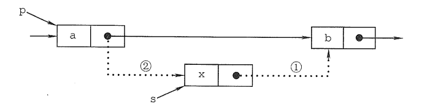
>
> * 将值为 s 的新结点插入到单链表的第 i 个位置，先检查i的位置是否合法
>
> * 然后找到待插入位置的前驱结点，即数组下标 第i-1 个结点
>   ①按序号查找算法GetElem(L,i-1)，令 p 所指结点的next指针，指向 p 所指的结点的next指针指的位置
>
>   ②然后让p的next指向要插入的s指针所指的结点

```c
// 单链表后插操作
p = GetElem(L, i-1);
s->next = p->next;
p->next = s;
```

**扩展：对指定结点进行前插操作**

> * 将 *s 插到 *p 的后面
> * 将p->data 与s->data互换
> * 时间复杂度为 O ( 1 ) 

```c
//
s->next = p->next;
p->next = s;
// 2.交换数据域data
ElemType temp = p->data;
p->data = s->data;
s->data = temp;
```


**删除结点操作 - 删除第i个结点**

> 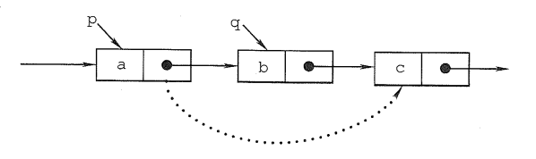
>
> - 将单链表第**i**个结点删除，先检查删除位置是否合法
> - 找到第**i-1**个结点，即前驱结点p
> - 将p的`next`指针指向q的下一个节点

```c
if (i <= 0)
		return -1;
LNode *p = GetElem(L, i-1);
LNode *q = p->next; 
p->next = q->next;
free(q);
```

**扩展：对指定结点进行删除操作**

> * 将 *p 的后继结点 *q 的值赋予 p，然后删除后继结点
> * 将p->data 与p->next->data互换
> * 释放掉 *q 节点
> * 时间复杂度为 O ( 1 ) 

```c
q = p->next;
p->data = q->data;
p->next = q->next;
free(q);
```


#### 求单链表长

```c
int Lenght(LinkList L) {
	LNode *p = L;
  	int len = 0;		// 统计表长
  	while(p != NULL) {     // while(p->next != NULL) {
     		p = p->next; 
    		len++;
    }
  	return len;
}
```


### 双链表

> 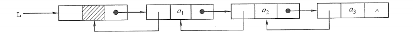
>
> 双链表有两个指针*prior*和*next*，分别指向*前驱结点*和*后继结点*
>
> 插入、删除时间复杂度为 O ( 1 ) 

```C
typedef struct DNode{					//定义双链表类型
		ElemType data;							//数据域
		struct DNode *prior,*next;	//前驱指针和后继指针
}DNode;
```


#### 双链表的插入

> 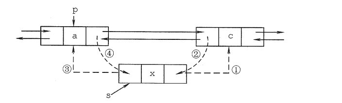
>
> ① s->next=p->next; 
>
> ② p->next->prior=s; 
>
> ③ s->prior=p; 
>
> ④ p->next=s;
>
> * ※第 **①** 步和第 **②** 步必需在第四步之前，否则 ***p** 的后继结点的指针会丢失，导致插入失败


#### 双链表的删除

> 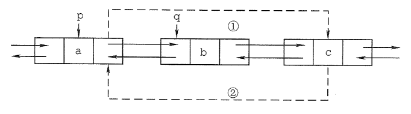
>
> ① p->next=q->next; 
>
> ② q->next->prior=p; 
>
> free (q);


### 循环链表

#### 循环单链表

> 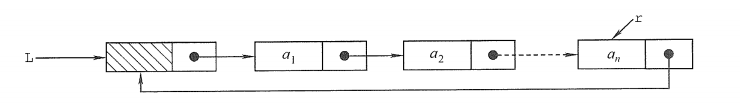


**单链表与循环单链表**

>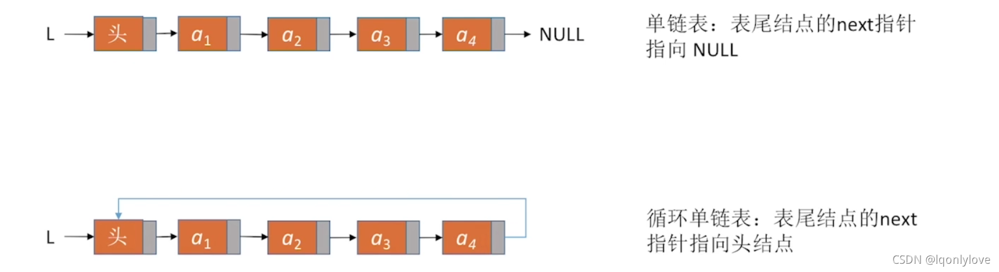
>
>
>
>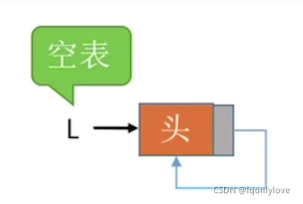
>
>**空表判断**：判断头结点 next 是否指向自身（`L->next == L`）。
>
>**表尾判断**：判断下一个结点是否等于L（`if(p->next == L)`）。


#### 循环双链表

**双链表与循环双链表**

>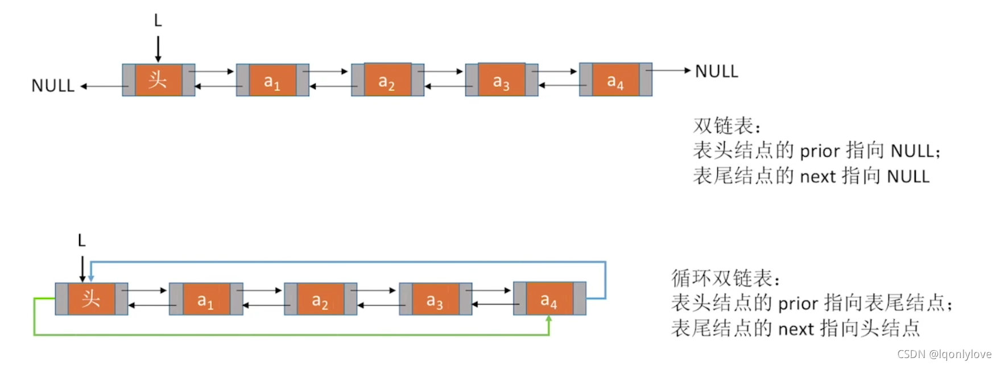
>
>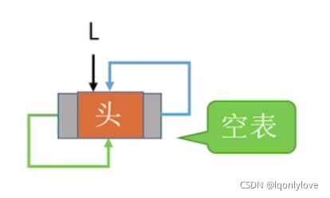
>
>**空表判断**：判断头结点 next 是否指向自身（`L->next == L && L->prior == L` ）。
>
>**表尾判断**：判断下一个结点是否等于L（`if(p->next == L)`）。


### 静态链表

> 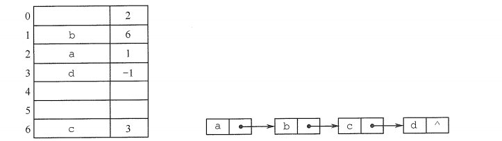
>
> **① 静态链表借助数组描述线性表的链式存储结构**
> **② 结点也有数据域data和指针域next，不过这里的指针指的是结点的相对地址（数组下标）**
> **③ 静态链表也要预先分配一块连续的内存空间**
>
> - 静态链表以**next ==-1**作为结束标志
> - 插入、删除操作与动态链表相同，只需要修改指针，不需要移动元素
> - 总体来说，静态链表没有单链表使用方便，当时对于不支持指针的高级语言来说（如：Basic），是一种非常巧妙的设计方法。

```c
#define MaxSize 50	//静态链表的最大长度
typedef struct{			//静态链表结构类型的定义
	ElemType data;		//存储数据元素
	int next;					//下一个元素的数组下标
}SLinkList[MaxSize];
```


## 2.3.顺序表和链表的比较

**1.存取（读写）方式**

```
顺序表：顺序存取，随机存取
链表：从头顺序存取
比如从第i个位置执行存或取的操作，顺序表仅需访问一次，链表需要从表头开始访问i次
```

**2.逻辑结构与物理结构**

```
顺序存储：逻辑上相邻的元素，对应的物理存储位置也相邻
链式存储：逻辑上相邻的元素，物理存储位置不一定相邻，对应的逻辑关系是通过指针链接来表示的
```

**3.查找、插入和删除操作**

```
对于按值查找，顺序表无序时，两者的时间复杂度均为O(n),顺序表有序时采用折半查找，时间复杂度为O(log2n)

对于按序号查找，顺序表支持随机访问,时间复杂度仅为O(1),链表的平均复杂度为O(n)

顺序表的插入、删除操作，平均需要移动半个表长的元素，链表的插入删除只需修改相关指针域
由于链表的每个结点带有指针域，故存储密度<1
```

**4.空间分配**

```
顺序存储:
①一旦存储空间装满就不能扩充，若加入新元素，会发生内存溢出，也因此需要预先分配足够大的存储空间
②预先分配过大，浪费内存，预先分配过小，内存溢出
③动态分配内存虽然存储空间可以扩充，但是需要移动大量元素，导致操作效率低
④若是内存没有更大块的连续存储空间，会导致分配失败

链式存储
只在需要时分配结点空间，只要内存有空间就可以分配，操作灵活，高效
```


## 考点2. 线性表

- 顺序表(数组)（算）

    > **插入：**先确定插入点是否合法，然后再将插入点之后的元素都**后移一位**，最后插入
    > **删除：**先确定删除点是否合法，然后再将删除点元素删除，最后将删除点之后的元素**前移一位**
    > 查找：按索引下标查找O(1)；按值查找O(n)

* 链表（选+算）

    > 单链表
    >
    > 1. 头插法、尾插法
    > 2. 删除结点
    > 3. **两种特殊处理\*：**(1)对p结点进行前插操作；(2)删除p结点;
    >
    > 双链表
    >
    > 1. 类似单链表的头插法、尾插法
    > 2. 类似单链表的删除结点
    >
    > 循环单链表：类似单链表
    >
    > 循环双链表：类似双链表
    >
    > **[静态链表](https://www.zhihu.com/search?q=静态链表&search_source=Entity&hybrid_search_source=Entity&hybrid_search_extra={"sourceType"%3A"article"%2C"sourceId"%3A165229143})\*：**利用数组结构来存储链表，起点为0，终点为-1
    >
    > **注意：**对链表结构的插入和删除操作常考选择题，链表要注意**头结点**这个概念。


# 第三章：栈与队列

> 考纲内容
>
> - 栈和队列的基本概念
> - 栈和队列的顺序存储结构
> - 栈和队列的链式存储结构
> - 栈和队列的应用
> - 特殊矩阵的压缩存储
>
> 要求内容
>
> - 栈和队列各种存储结构的特点
> - 数组和特殊矩阵的压缩存储

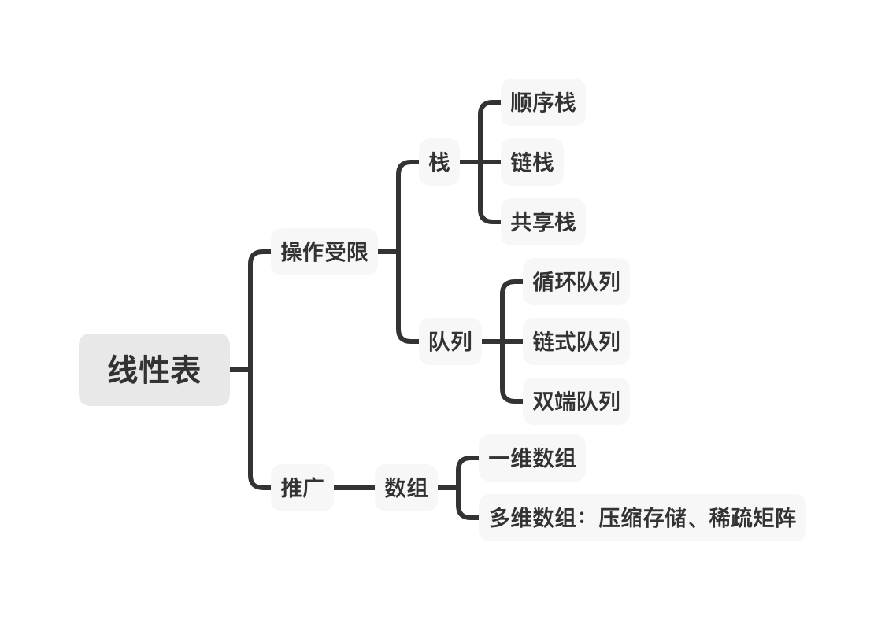

## 栈

[408数据结构——栈和队列](https://blog.csdn.net/qq_21457395/article/details/121721713?spm=1001.2014.3001.5501)

### 基本概念

> - 栈 (**Stack**) 是**只允许在一端进行插入或者删除操作**的**线性表**
>
> * 栈的操作特性可以概括为：**后进先出（LIFO）**
> * 栈的数学性质： n 个不同的元素进栈，出栈元素不同的排列个数为，该公式称为卡特兰数（Catalan）

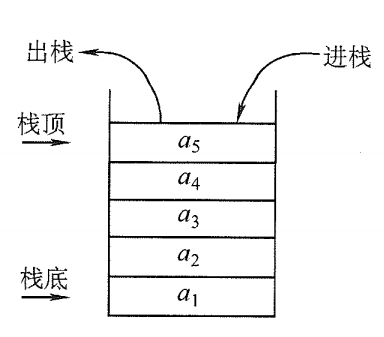

**基本操作**

```C
//【注意】算法题中，若题干没有做限制，可直接使用基本的操作函数
InitStack(&S)  	// 初始化一个栈
StackEmpty(S)		// 判断栈是否为空，为空放回true，否则返回false
Push(&S,x)			// 进栈，若栈没满，则加入元素x成为新栈顶
Pop(&S,&x)			// 出栈，若栈非空，则弹出栈顶元素并用x返回
GetTop(S,&x)		// 读取栈顶元素，若栈非空则用x返回栈顶元素
DestroyStack(&S)// 销毁栈并释放存储空间 
```


### 栈的顺序存储结构

#### 顺序栈

> - 采用**顺序存储**的栈称为顺序栈，利用一组地址连续的存储单元存放自栈底到栈顶的数据元素，同时设一个指针（**top**）指向当前栈顶的元素

```c
#define MaxSize 50	//定义栈中元素最大个数
typedef struct{
	Elemtype data[MaxSize];	//存放栈中元素
	int top;	//栈顶元素
}SqStack;
```

- 栈顶指针：S.top，初始设置**S.top= -1**（有些辅导书从0开始）；栈顶元素**S.data[S.top]**
- 进栈操作，栈不满时，栈顶指针先加 **1** ,再送值到栈顶元素 
- 出栈操作：先取栈顶元素，再将栈顶指针减**1**
- 栈空条件：**S.top=-1**; 栈满条件：**S.top==MaxSize-1**; 栈长：**S.top+1**

##### 顺序栈的基本运算

```C
void test() {
	SqStack S;		// 声明一个顺序栈
  	InitStack(S); // 初始化
}
```

(1)初始化

```cpp
void InistStack(Sqstack &S){
	S.top = -1;	//初始化栈顶指针
}
```

(2)判断空

```cpp
bool StackEmpty(Sqstack &S){
	if(S.top == -1)	//栈空
		return true;
	else	//栈不空
		return false;
}
```

(3)进栈
**S.top =S.top+1 和 S.data[S.top] = x 等价于 S.data[++S.top]=x**;

```cpp
bool Push(SqStack &S, ElemType x){
	if(S.top == MaxSize-1)	//栈满，报错
		return false;
	S.data[++S.top] = x;	//指针先加1，再入栈
	return true;
}
```

(4)出栈
**S.data[S.top] = x和 S.top = S.top-1 等价于 x=S.data[S.top-- ]**;

```cpp
bool Pop(SqStack &S, ElemType &x){
	if(S.top == -1)	//栈空，报错
		return false;
	x = S.data[S.top--];	//先出栈，指针再减1
	return true;
}
```

(5)读栈顶元素
仅读取栈顶元素，并没有执行出栈操作，原栈顶元素依然保留在栈中

```cpp
bool GetTop(Sqstack S,ElemType &x){
	if(S.top == -1)	//栈空，报错
		return false;
	x = S.data[S.top];	//x记录栈顶元素
	return true;
}
```

注意

- 这里的**top**指向的是栈顶元素，所以进栈操作为**S.data[++S.top]=x**,出栈操作为**x=S.data[S.top --];**
- 若栈顶指针初始为S.top=0，则**top**指向栈顶元素的下一个位置，这样入栈操作变为 **S.data[S.top++]=x**，先入栈，指针再加1；出栈操作变为 **x=S.data[ --S.top]**，指针先减1，再出栈


#### 共享栈

> - 利用栈底位置相对不变的特性，可以让两个顺序栈共享一个一维数组空间
> - 把两个栈的栈底分别设置在共享空间的两端，然后两个栈顶向共享空间的中间延伸

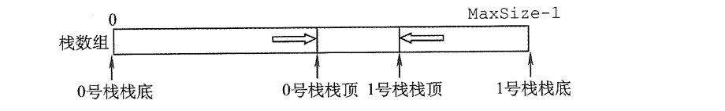

- 两个栈的栈顶指针都指向栈顶元素，**top0=-1**时0号栈为空，**top1=MaxSize**时1号栈为空
- 仅当两个栈顶指针相邻（**top1-top0=1**）时，为栈满
- 0号栈进栈时栈顶指针top0先加1再赋值，1号栈进栈时top1先减1再赋值，出栈时则刚好相反
- 共享栈是为了更有效的利用存储空间，两个栈的空间相互调节，整个存储空间被占满才会上溢，存取数据的时间复杂度为 O(1)

##### 共享栈的基本运算

```c
#define MaxSize 50		//两个共享栈所能达到的最大长度
#define Elemtype int	//假设元素类型为整数型
typedef struct{
	Elemtype stack [MaxSize];
	int top[2]；//top为两个栈顶指针
}stk;
stk s;	//定义的结构体变量
```

```c
// (1)入栈操作
// i为栈号，i=0为左边的栈top0,i=1为右边的栈top1
// 入栈成功返回1，否则返回0
int Push(int i,Elemtype x){
	if(i<0||i>1){
		printf("栈号输入错误");
		exit(0);
	}
	if(s.top[1]-s.top[0]==1){
		printf("栈已满");
		return 0;
	}
	switch(i){
		case 0: s.stack[++s.top[0]]=x; return 1; break;
		case 1: s.stack[--s.top[1]]=x; return 1; 
	}
}	

// (2)退栈操作
// 退栈成功返回退栈元素，否则返回-1
int Pop(int i,Elemtype x){
	if(i<0||i>1){
		printf("栈号输入错误");
		exit(0);
	}
	switch(i){
	case 0: 
		if(s.top[0]==1){
		printf("栈空");
		return -1;
	}
	else
		return s.stack[s.top[0]--];
	case 1:
		if(s.top[1]==MaxSize){
			printf("栈空");
			return -1;
		}
		else
			return s.stack[s.top[1]++];
	}//switch
}	
```


### 栈的链式存储结构

#### 链栈

> 带头结点 与 不带头结点 链表头插法
>
> 操作与链表相同，入栈与出栈的操作都在表头进行。

```c
typedef struct Linknode {
	ElemType data;
	struct Linknode *next;
} *LiStack;

// 不带头结点
void Link_Push(Linknode &s, ElemType x) {  	
    Linknode *node = (Linknode *)malloc(sizeof(Linknode));
    node->data = x;
  	node->next = s;
  	s = node;
}

// 带头结点
void Link_Push(Linknode &s) {  	
	s = (Linknode *)malloc(sizeof(Linknode));
  	L->next = NULL;
  	
	int i;
  	scanf("%d", &x);
  	while(x != 9999) {
     	Linknode *node = (Linknode *)malloc(sizeof(Linknode));
      	node->data = x;
      	node->next = L->next;
      	L->next = node;		//头结点指向新结点
    }
}
```


## 队列

### 基本概念

> 队列也是一种操作受限的线性表，只允许在一端进行插入，而在另一端进行删除。其操作特性是**先进先出 (First In First Out,FIFO)**
>
> - 队头（**Front**） 允许删除的一端
> - 队尾（**Rear**） 允许插入的一端

 **队列基本操作**

```c
InitQueue (&Q) 	// 初始化队列，构造一个空队列Q
QueueEmpty (Q) 	// 判断列空，若队列Q为空返回true，否则返回false
EnQueue (&Q,x) 	// 入队，若队列Q未满，将x加入，使之成为新的队尾
DeQueue (&Q,&x) // 出队，若队列非空，删除队头元素并用x返回
GetHead (Q,&x)  // 读取队头元素，若队列Q非空，则将队头元素赋值给x
```


### 队列的顺序存储结构

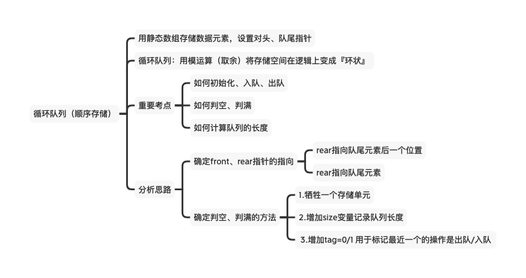


```c
#define Maxsize 50	//定义队列中元素的最大个数
typedef struct{
	ElemType data[MaxSize];	// 静态数组存放队列元素
	int front,rear;			// 队头指针和队尾指针，说明：front指向队头元素，rear指向队尾的下一个位置。
}SqQueue;  // Sq: Sequence
```

* 初始状态：队空条件，Q.front = Q.rear = 0
* 进队操作：队不满时，先送值到队尾元素，再将队尾指针+1
* 出队操作：队不空时，先取队头元素，再将队头指针+1
* **所以此处队列有明显缺陷，指针都在往后移动，导致前面空间的浪费。从而引出了循环队列。**

```c
// 初始化队列
void InitQueue(SqQueue &Q) {
 	// 初始化时，队头与队尾指针指向0
  	Q.rear = Q.front = 0;
}

// 判断队列是否为空
bool QueueEmpty(SqQueue Q) {
 	if(Q.rear == Q.front) 
      	return true;
  	else 
      	return false;
}

bool EnQueue(SqQueue &Q, ElemType e) {
  	if (QueueEmpty(Q))
        return false;
    Q.data[Q.rear] = x;
}

//
void testQueue() {
  	SqQueue Q;
  	InitQueue(Q);
}
```


### 队列的链式存储结构


### 双端队列

## 应用

### 栈 - 括号匹配

Demo在Example中

### 栈 - 表达式

> 波兰数学家
>
> 灵感：可以不用界定符也能无歧义的表达运算顺序
>
> 后缀表达式 = Reverse Polish Notation = 逆波兰表达式
>
> 前缀表达式 = Polish Notation = 波兰表达式

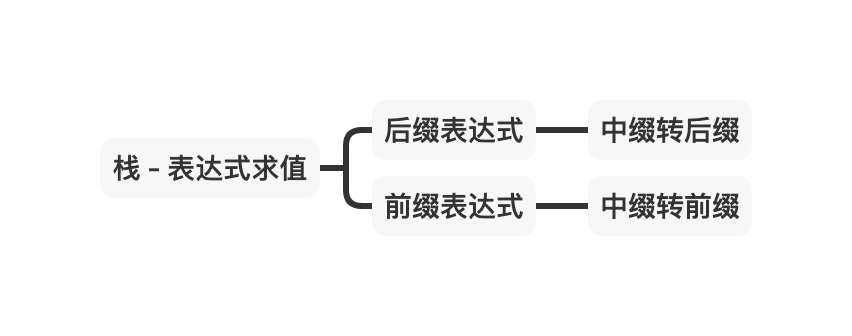

> 表达式组成：**操作数、运算符、界定符**
>
> 中缀表达式：运算符在两个操作数中间   `a + b`
>
> 后缀表达式：运算符在两个操作数后面   `ab+`
>
> 前缀表达式：运算符在两个操作数前面   `+ab`


#### 中缀转后缀（手算）

> 基本步骤：
>
> 1. 确定中缀表达式中 **各个运算符的运算顺序**；
> 2. 选择下一个运算符，按照 **【左操作数  右操作数  运算符】** 的方式组合成一个新的操作数；
> 3. 继续2知道结束。
> 4. **【左优先原则】：**只要左边的运算符能先计算，则优先计算左边的！！！**保证运算顺序的唯一性！！！**

**简单例子**

| 中缀表达式 | 后缀表达式 | 前缀表达式 |
| :--------- | ---------- | ---------- |
| a+b        | ab+        | +ab        |
| a+b-c      | Ab+c-      | -+abc      |
| a+b-c*d    | ab+cd*-    | -+ab*cd    |

**复杂例子**

> 分析：
>
> 正常计算下列都是对滴，可以先算 * /，再算 + -
>
> 但是计算机算法性质：唯一性，准确性
>
> 所以此处引入：**【左优先原则】**只要左边的运算符能先计算，则优先计算左边的！！！

| A + B * （C - D）- E / F            | A + B * （C - D）- E / F            |
| ----------------------------------- | ----------------------------------- |
| 3    2        1       5   4         | 5    3       2       4     1        |
| A B C D - * + E F / -      （正确） | A B C D - * E F / - +      （错误） |
| 1 2 3     4 5                       | 2 3      1 4 5                      |

**练习**

| ((15 / (7 - ( 1 + 1 ))) * 3) - (2 + (1 + 1)) |
| -------------------------------------------- |
| 答案：15 7 1 1 + - / 3 * 2 1 1+ + -          |


#### 中缀转后缀（机算）


#### 后缀表达式的计算（机算）

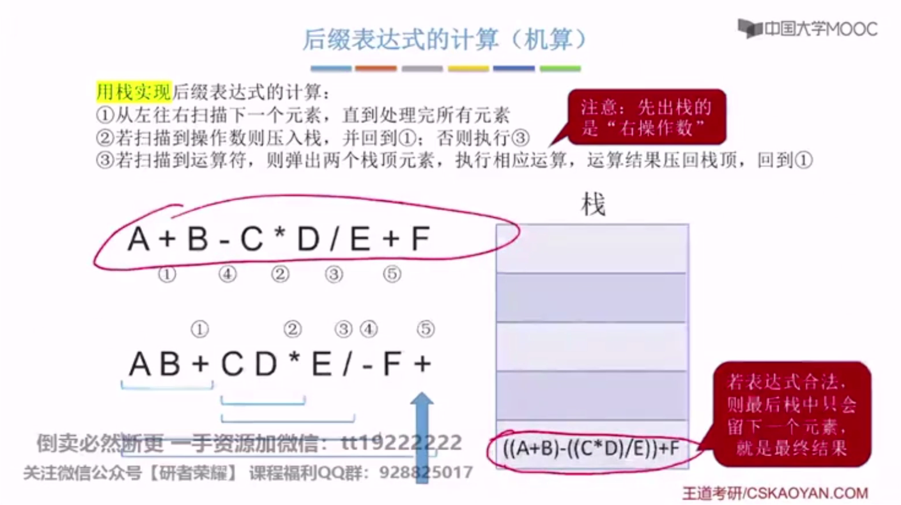

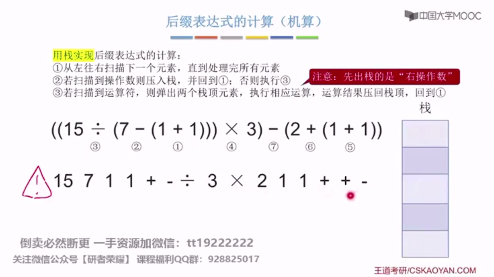


#### 中缀表达式的计算（机算）

1. 中缀转后缀
2. 后缀表达式的计算（机算）


#### 中缀转前缀（手算）

> 基本步骤：
>
> 1. 确定中缀表达式中 **各个运算符的运算顺序**；
> 2. 选择下一个运算符，按照 **【 运算符 左操作数  右操作数】** 的方式组合成一个新的操作数；
> 3. 继续2知道结束。
> 4. **【右优先原则】：**只要右边的运算符能先计算，则优先计算右边的！！！**保证运算顺序的唯一性！！！**

**例子 - 右优先原则**

| A + B * (C - D) - E / F           | A + B * (C - D) - E / F              |
| --------------------------------- | ------------------------------------ |
| 5     3     2     4   1    (正确) | 3     2      1     5   4    （错误） |
| + A - * B - C D / E F             | - + A * B - C D / E F                |


#### 中缀转后前缀对比

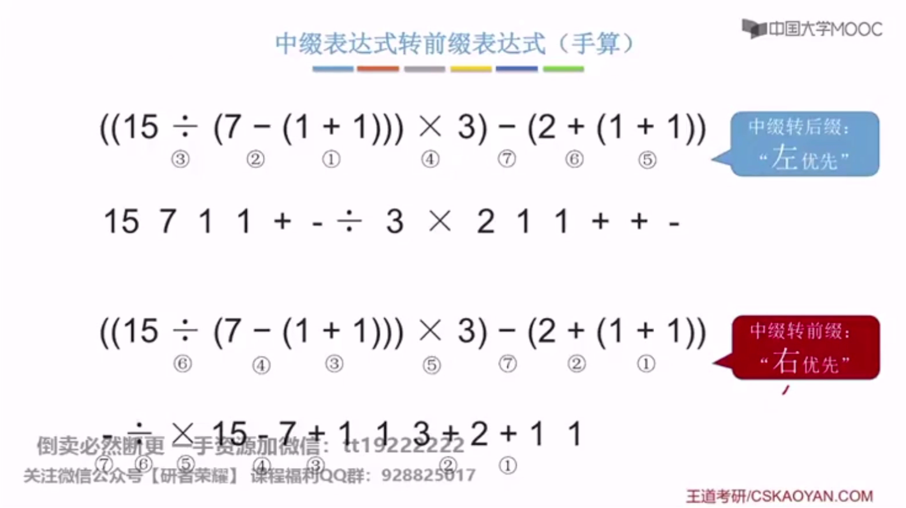


#### 前缀表达式的计算（机算）

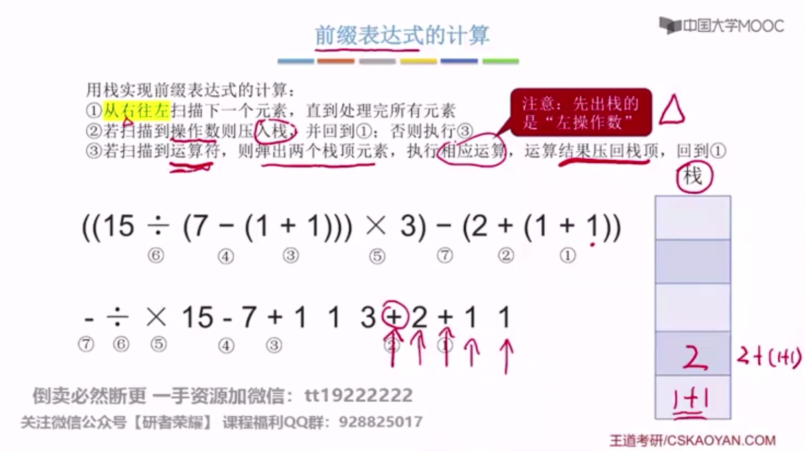


### 栈 - 递归

> 适合使用递归算法：可以把原始问题转换为 **属性相同**，但 **规模较小** 的问题。
>
> 缺点：太多层递归可能会导致 **栈溢出** ！！

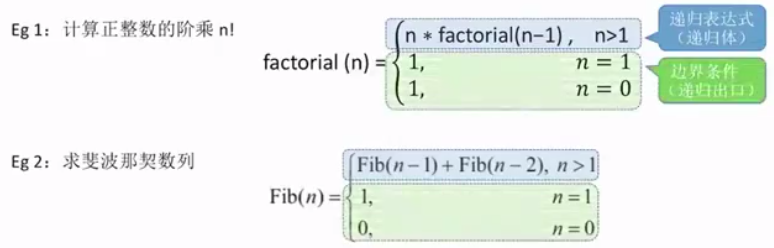

```
// eg1：n!
int factorial(init n) {
	if(n == 0 || n == 1) {
		return 1;
	} else {
		return n*factorial(n-1);
	}
}

int main() {
	int x = factorial(10);
	printf("%d", x);
	return 0;
}
```

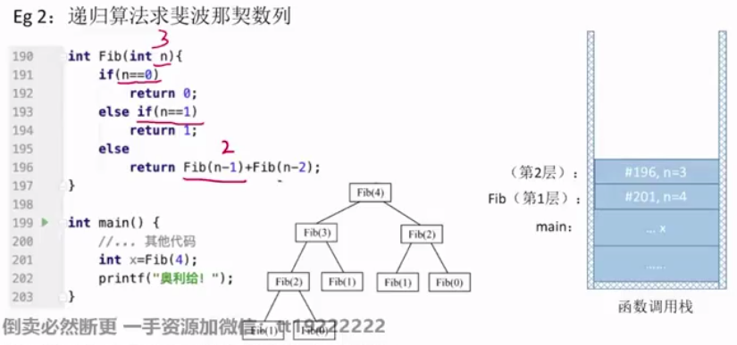


### 队列 - 树的层次遍历

TODO...

### 队列 - 图的广度优先遍历

TODO...

### 队列 - 操作系统的应用

FCFS（First Come First Service）先来先服务

* CPU资源分配
* 打印机的数据缓冲区


### 特殊工艺矩阵的压缩存储

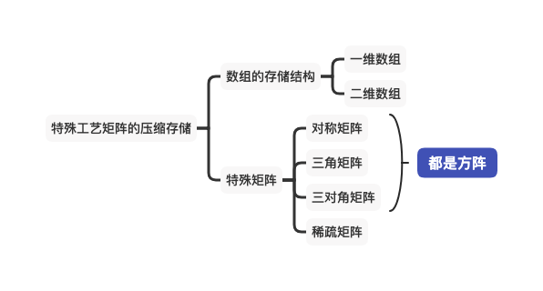

#### 一位数组

> ElemType a[10];
>
> 起始地址：LOC
>
> 数组a[i]的存放地址 = LOC + i * sizeof(ElemType)     （0 <= i < 10，默认下标从0开始）
>
> 若从下标从1开始：a[i]的存放地址 = LOC + (i - 1) * sizeof(ElemType)  


#### 二维数组

> 行优先、列优先
>
> 本质：将非线性的二维数组，拉成线性的，因为计算机内存的存储空间是线性的。

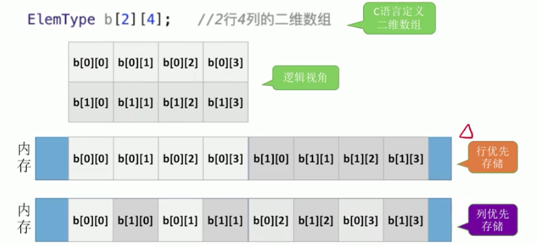

**行优先**

M行N列的二维数组 b\[M][N]中，若按照 `行优先` 存储，则

> b\[i][j]的存储地址 = LOC + （i * N + j）* sizeof(ElemType)

**列优先**

M行N列的二维数组 b\[M][N]中，若按照 `列优先` 存储，则

> b\[i][j]的存储地址 = LOC + （j * M + i）* sizeof(ElemType)


#### 普通矩阵

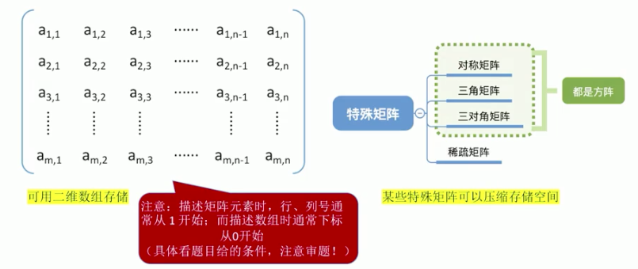


#### 对称矩阵

> **特点：a(i,j) = a(j,i)**
>
> 存储策略：只存储主对角线 + 下三角 / 上三角

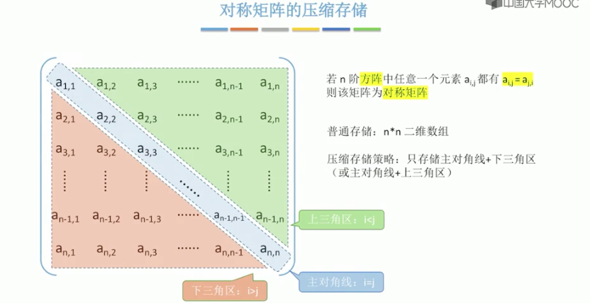

**策略一：主对角线 + 下三角 + 行优先 + 一维数组**

> 思考：
>
> 一. 数组大小？(数组从0开始)
>
> ​	数组大小：`1+2+3+...+n = (1+n)*n / 2`
>
> ​	最后一个数组元素下标：`(1+n)*n / 2 - 1`
>
> 二.如何快速存取？
>
> ​	映射函数：矩阵下标 —> 一维数组下标
>
> * a(i,j) (i>=j)  —> B[k]    （下三角区域）
>     * [1+2+3+...+(i-1) + j] = (1+i-1)(i-1)/2 + j = i(i-1)/2 + j
>     * k = i(i-1)/2 + j - 1
>
> * a(i,j) (i<j)  —> B[k]     （上三角区域）
>     * 因为 a(i,j) = a(j,i)，所以 k = j(i-1)/2 + i - 1

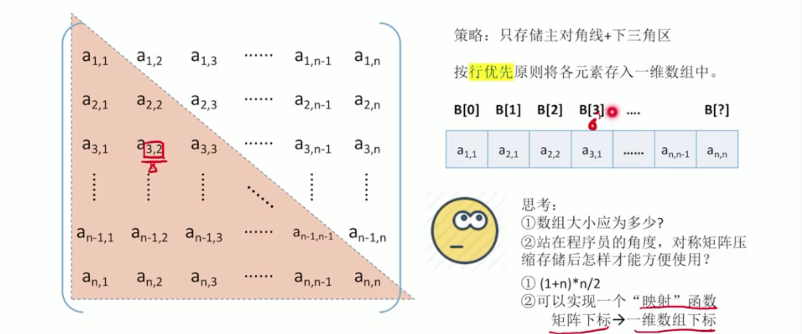

**策略二：主对角线 + 下三角 + 列优先 + 一维数组**

> * a(i,j) (i>=j)  —> B[k]    （下三角区域）
>
>     第一列：n       (恒等于n+1)
>
>     第二列：n-1	 (恒等于n+1)
>
>     ...
>
>     第 j-1 列：n-j+2  (恒等于n+1)
>
>     第 j 列：n-j+1 	 (恒等于n+1)
>
>     * 前面完成的 j-1列和 = n + (n-1) + ... + (n-j+2)
>
>     * 最后剩下的 = i - j + 1
>     * 所以 k = `{[n + (n-j+2)](j-1)} / 2 + (n-j+1) -1 `
>
> * a(i,j) (i<j)  —> B[k]     （上三角区域）
>
>     * 因为 **a(i,j) = a(j,i)**，所以 k = `{[n + (n-i+2)](i-1)} / 2 + (n-i+1) -1 `


#### 三角矩阵

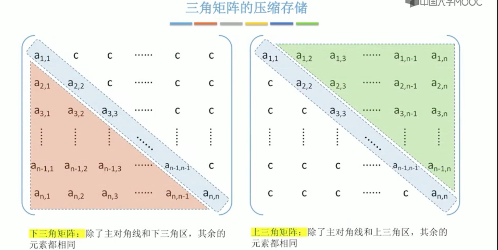


**三角矩阵 + 下三角 + 行优先 + 一维数组**

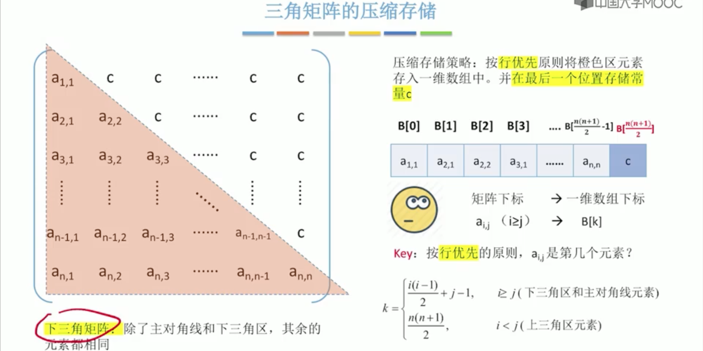

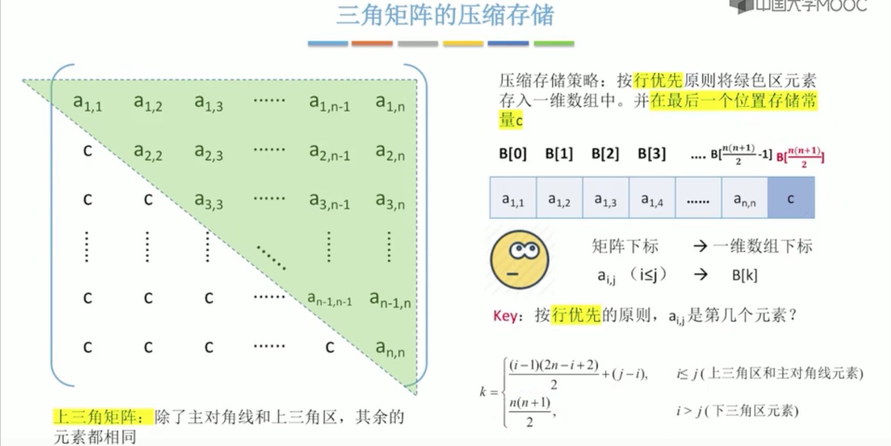


#### 三对角矩阵

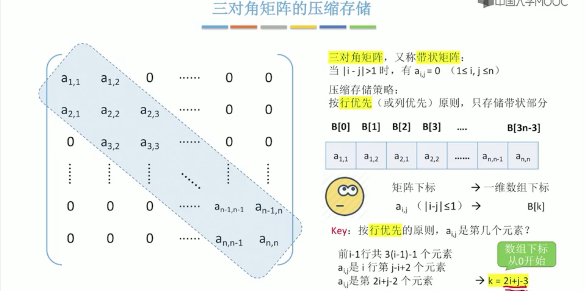

**已知k，反推 第i行 第j列**

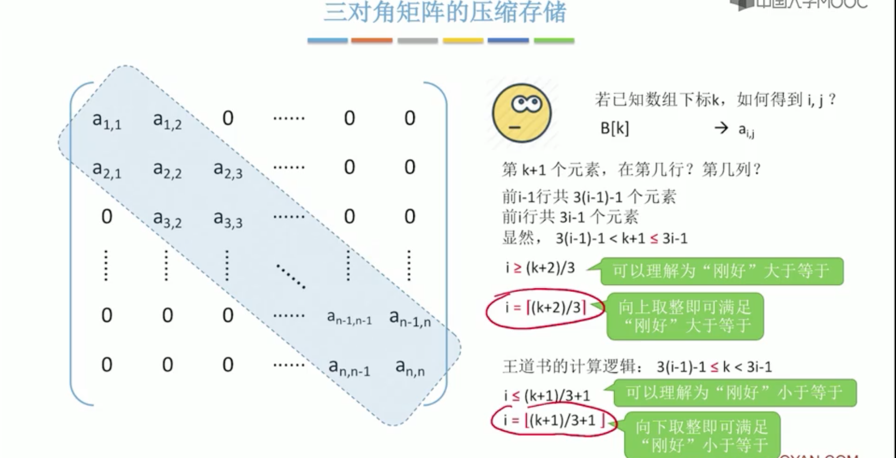


#### 稀疏矩阵

**存储策略一：顺序存储**

> 缺点：失去随机存取的特性

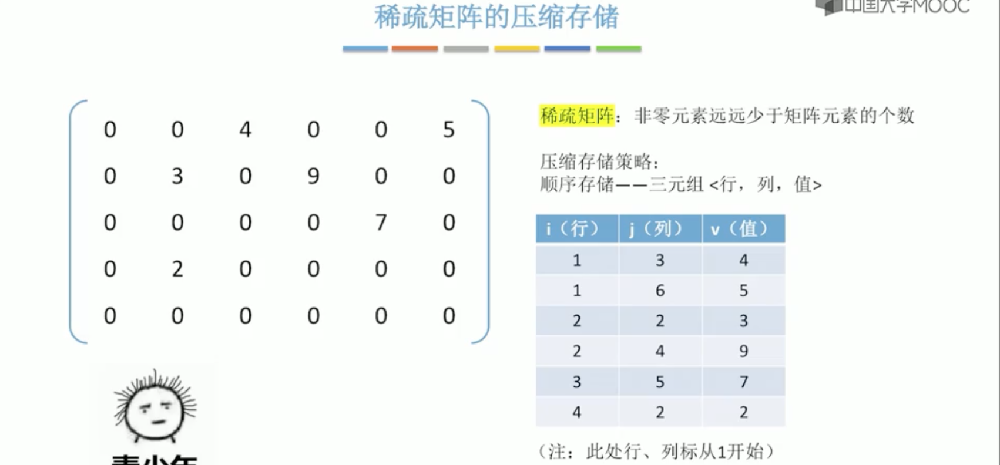


**存储策略二：十字链表法**

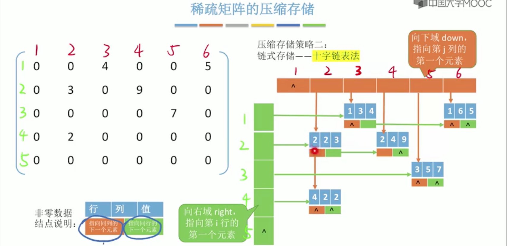


## 考点3. 栈和队列

- 栈（选）

> 1.顺序栈的top指针特点（区分队列的rear指针）
> 2.一串数列通过栈来处理能获得新序列的数量（Catlan公式）和可能得到的新序列
> 2.栈在括号匹配上的应用
> **3.栈在中缀表达式与后缀表达式的相互转换的应用\*(熟练掌握转换的中间过程)**

- 队列（选）

> 1.顺序队列的rear指针的特点
> **2.顺序循环队列判空判满的条件\*：(1)牺牲空间法；(2)size法；(3)tag标记法**
> **3.栈在二叉树层次遍历中的应用\*（变形：利用标记法来辅助确定出当前结点位于那一层）**

- 矩阵压缩存储（选）

> 1. 矩阵的压缩存储是套路题，做法如下：
>    (1)看题，分析是按行存储还是按列存储
>    (2)找出等差/等比规律
>    (3)求[等差数列](https://www.zhihu.com/search?q=等差数列&search_source=Entity&hybrid_search_source=Entity&hybrid_search_extra={"sourceType"%3A"article"%2C"sourceId"%3A165229143})/等比数列和，确定出压缩公式
> 2. 稀疏矩阵的存取方式：三元组、[十字链表](https://www.zhihu.com/search?q=十字链表&search_source=Entity&hybrid_search_source=Entity&hybrid_search_extra={"sourceType"%3A"article"%2C"sourceId"%3A165229143})、行逻辑链接顺序表


# 第四章：串

> 串：字符串（string）由 **零个 或 多个字符** 组成的有限序列。
>
> 【注意】：位序从1开始


```c
// 基本操作
Index(S, T);   // 定位操作
StrCompare(S, T)	// 比较操作，每个字符在计算机中对应一个二进制数，字符比较 本质也就是 二进制数的比较
```


## 串的存储结构

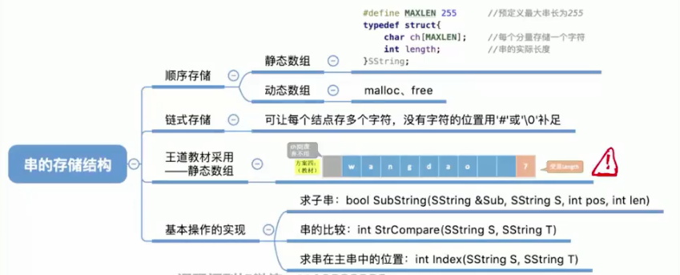

**顺序存储**

```c
#define MAXLEN 255

typedef struct {
 	char ch[MAXLEN];
    int length;		// 串的实际长度
} SString;	// 静态数组实现，定长顺序存储，自动申请、释放空间

typedef struct {
 	char *ch;
    int length;		// 串的实际长度
} HString;	// 动态数组实现，堆分配存储，手动申请空间，手动释放空间
```

**链式存储**

```c
// 存储密度低，字符1B，指针4B
typedef struct StringNode {
	char ch;	// 每个结点1个字符
    struct StringNode *next;		// 指针4字节
} StringNode, *String;

// 改进
typedef struct StringNode {
	char ch[4];		// 每个结点存多个字符
    struct StringNode *next;
}StringNode, *String;
```

### 基于顺序存储实现基本操作


## 串的朴素匹配算法


### **树**

树重点掌握二叉树的性质，和二叉树的顺序存储和链式存储。以及线索二叉树。树的三种遍历也是经常考。在树的应用中，掌握二叉树排序树、二叉树平衡树、哈夫曼树。

### **图**

图中，一定要搞清楚图的基本术语，因为图的术语有很多。无向图和有向图都不一样。

其中掌握图的顺序存储和链式存储；图的遍历经常考，DFS、BFS；

图的应用一定要会手动的模拟，写不出算法没有关系。最小生成树、最短路径、拓扑排序、关键路径。

### **查找**

查找是基于排序的，有些乱序的序列需要先排好序后再查找。其中折半查找和查找树以及散列查找，hash函数经常考。

KMP算法 明白原理即可。

### **排序**

排序的算法很多，408要求主要掌握内部排序。重点搞清楚 交换排序 和选择排序，要明白各种排序的优势在哪儿和时间复杂度。


# 《数据结构》考点

### 2.4 树和二叉树

- 树和二叉树的基本概念（选）

> 1.树的性质：区分树的度和图的度
> 2.二叉树的性质：
> （1）n0 = n2 +1;
> （2）完全二叉树i结点的左孩子为2i，右孩子为2i+1 (从1开始编号)

- 二叉树的存储方式（选）

> \1. 顺序存储，其实就是按照完全二叉树来存储
> \2. 链表存储：链表的空指针数 = 结点数n + 1

- 二叉树的遍历方式（选+算）

> 四种遍历方式（先序，中序，后序，层次）
> 其中先序中序后序不仅要掌握递归方式还要掌握非递归方式，层次遍历需要借助队列来实现；**[线索二叉树](https://www.zhihu.com/search?q=线索二叉树&search_source=Entity&hybrid_search_source=Entity&hybrid_search_extra={"sourceType"%3A"article"%2C"sourceId"%3A165229143})**是在先序中序后序递归实现方式上的变形（重点）

- 二叉树的应用（选+应）

> \1. 并查集：图里面最小生成树的基础
> \2. 二叉排序树(算)：代码模板记住
> 3.平衡二叉树AVL(选)：掌握LL型、RR型、LR型、RL型的调整过程
> 3.哈夫曼树和[哈夫曼编码](https://www.zhihu.com/search?q=哈夫曼编码&search_source=Entity&hybrid_search_source=Entity&hybrid_search_extra={"sourceType"%3A"article"%2C"sourceId"%3A165229143})(选+应)：不仅会画图还要会用文字来叙述

### 2.5 图

- 图的概念（选）

> \1. 图的度与树的度的区分
> \2. [有向图](https://www.zhihu.com/search?q=有向图&search_source=Entity&hybrid_search_source=Entity&hybrid_search_extra={"sourceType"%3A"article"%2C"sourceId"%3A165229143})与无向图的区分（连通性，强连通性）
> \3. 简单路径与简单回路
> \4. 距离：最短路径

- 图的存储方式（选+应一个小问）

> \1. [邻接矩阵](https://www.zhihu.com/search?q=邻接矩阵&search_source=Entity&hybrid_search_source=Entity&hybrid_search_extra={"sourceType"%3A"article"%2C"sourceId"%3A165229143})*
> \2. 邻接表*
> \3. 十字链表(有向图)
> \4. 邻接多重表(无向图)

- 图的遍历方式（选+算）

> \1. BFS：类似二叉树的层次遍历；注意BFS的变形--求单源最短路径
> \2. DFS：类似二叉树的先序遍历；
> **3. BFS与DFS都需要借助辅助数组visited[]来标记当前结点是否被访问过**
> **4. 图的遍历与图的连通性的关系\***

- 图的应用（选+应）

> **1. 最小生成树**
> （1）prim算法
> （2）Kruskal算法
> **2. 最短路径**
> （1）dijkstra算法
> （2）Floyd算法
> **3. [拓扑排序](https://www.zhihu.com/search?q=拓扑排序&search_source=Entity&hybrid_search_source=Entity&hybrid_search_extra={"sourceType"%3A"article"%2C"sourceId"%3A165229143})：**可以用来判断图是否有环
> **4.关键路径**

### 2.6 查找

- 顺序查找（选）

> \1. 普通顺序表：进行普通的从小到大的遍历查找插入点，然后**插入**
> **2. 有序顺序表\*：**进行二分的思想进行查找插入点，然后**插入 --- 记住二分思想的核心代码**
> 以上两种方式由于都需要进行插入，故时间复杂度为O(n^2)

- 分块查找（选）

> 使用了索引表+查找表的结构：
> （1）索引表：有序表 --- 二分查找
> （2）查找表 --- 根据索引分块后采用顺序查找方式查找

- 二叉排序树、AVL树(平衡二叉树)、B树、B+树（选）

> \1. 二叉排序树上的查找
> \2. AVL树上的查找：其实就等效为二叉排序树上的查找，因为AVL树就是一颗二叉排序树
> \3. B树：
> （1）概念：包含m/2向上取整-1 <= n(非根结点) <= m-1；[叶子结点](https://www.zhihu.com/search?q=叶子结点&search_source=Entity&hybrid_search_source=Entity&hybrid_search_extra={"sourceType"%3A"article"%2C"sourceId"%3A165229143})不含数据，数据存在索引上等
> （2）B树高度求法：logm^(n+1) <= h <= logm/2向下取整^(n+1)/2 + 1
> （3）B树插入：可能使B树高度h+1
> （4）B树删除：可能使B树高度h-1
> \4. B+树
> （1）B+树的概念
> （2）B+树与B树的区别
> **（3）B+树的特点：**数据都存在叶子结点上，非终端结点只起索引作用；B+树可以有两种查询方式
> **注意：B/B+一般是以选择题的形式考察，并且考察的深度不高，我们只需要学习基本知识就可以**

- 散列表（选+应）

> \1. [散列函数](https://www.zhihu.com/search?q=散列函数&search_source=Entity&hybrid_search_source=Entity&hybrid_search_extra={"sourceType"%3A"article"%2C"sourceId"%3A165229143})：直接定址法、除留取余法是重点，其他了解即可
> \2. 处理冲突：
> （1）开放定址法：线性探测法、平方探测法、再散列法是重点
> （2）拉链法
> \3. 装填因子
> **4. 求散列表上查找成功/不成功的平均查找数\***

- KMP（选+算+应）

> KMP算法的核心是next[]数组，掌握**计算机的next[]数组，**这里说的计算机的next[]数组是相当于手动模拟的next[]数组而言的，408考察的是计算机的next[]数组
> 计算机next[] = 手动模拟的next[] **右移一位 + 1**
> **KMP算法记下来，注意KMP的特点是主串不回溯**

### 2.7 排序

- 插入排序（选）

> \1. 直接插入排序
> \2. 折半插入排序：引入二分思想
> \3. [希尔排序](https://www.zhihu.com/search?q=希尔排序&search_source=Entity&hybrid_search_source=Entity&hybrid_search_extra={"sourceType"%3A"article"%2C"sourceId"%3A165229143})

- 交换排序（选+算）

> \1. 冒泡排序
> **2. 快速排序：把Partition函数当模板记下来**

- 选择排序（选）

> \1. 简单选择排序
> \2. 堆排序：向下调整 、向上调整
> （1）堆的构建：向下调整，这里的时间复杂度为O(n)要知道为什么
> （2）堆排序：向下调整

- 归并排序（选+算）

> 掌握Merge函数，当模板记下来

- 基数排序（选+算）

> 基数排序是给予非比较的排序
> 拓展：桶排序、计数排序

- 外部排序--多路归并排序（选）

> \1. 败者树：要会自己构建败者树，败者树可以减少比较次数
> \2. 置换-选择排序：划分初试归并段
> \3. 最佳归并树：减少归并过程中的I/O次数
> **注意：虽然外部排序的内容少，但是外部排序的难度比内部排序的难度要高，幸运的是外部排序基本以选择题形式考察；学习外部排序重点是学习思想，要去真正的理解它。**

------

## 3. 经验总结

1. 在408真题中的数据结构部分的题目可以看出：选择题大多考察相应结构/算法的中间过程，这就要求我们必须深刻的理解和熟练的掌握此结构/算法，能从计算机的角度出发去思考计算机处理这个问题处理的整个过程是什么样的，而不要从个人主观上出发去看此结构/算法，因为这样只是表面上搞懂了此结构/算法，但是一做题该错的还是错，不会的还是不会；大题部分重点在于积累和做题，因为408真题中算法大题和应用大题基本上每一年考察的知识点和思想都不是很相同，所有我们需要多去做大题，虽然大题比较难做，但是一点要坚持去把王道的课后大题都做完，一边做一边去思考，慢慢的就会变好。
2. 选择题经常有很多坑，做题不要想当然，写答案前多问问自己这题真的是这样？真的这麽简单？比别人想的更多才能比别人走的更远；大题主要强调的是思想，多去想想算法大题有什么其他的解法，应用大题考的知识点是哪些，一定要做到看完题目心中有数，方能不乱阵脚。


# 题目

