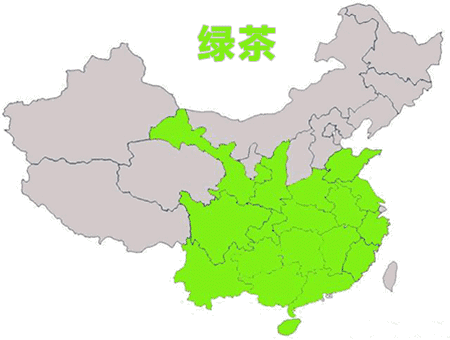

# 茶 - Tea

https://zhuanlan.zhihu.com/p/67724496

## English

绿茶（green tea）

白茶（white tea）

黄茶（yellow tea）

乌龙茶（青茶）（oolong tea）

黑茶（dark tea）

红茶（black tea）

## 茶分类

> 到了今天，中国茶类的划分有多种方法，公认的是 **根据制作方法** 和 **茶多酚氧化（发酵）程度** 的不同，可分为六大类：
>
> * 绿茶（不发酵）
> * 白茶（轻微发酵）
> * 黄茶（轻发酵）
> * 青茶（也叫乌龙茶、半发酵）
> * 黑茶（后发酵）
> * 红茶（全发酵）
>
> 外观由绿向黄绿、黄、青褐、墨绿、黑色渐变，茶汤也由绿向黄绿、黄、青褐、红褐色渐变。

## 十大名茶

* 中国十大名茶由1959年全国“十大名茶”评比会评选，包括西湖龙井，洞庭碧螺春，黄山毛峰，庐山云雾茶，六安瓜片，君山银针，信阳毛尖，武夷岩茶，安溪铁观音，祁门红茶。（顺序是有先后讲究的）

* 1915年巴拿马万国博览会将碧螺春、信阳毛尖、西湖龙井、君山银针、黄山毛峰、武夷岩茶、祁门红茶、都匀毛尖、铁观音、六安瓜片列为中国十大名茶。

* 1982年6月10日至16日在湖南长沙召开了全国名茶评选会，会议评选出全国名茶三十个，并对发展名茶生产提高茶叶质量提出了意见。

* 1999年《解放日报》将江苏碧螺春、西湖龙井、安徽毛峰、安徽瓜片、恩施玉露、福建铁观音、福建银针、云南普洱茶、福建岩茶、江西云雾茶列为中国十大名茶。

* 2001年美联社和《纽约日报》将黄山毛峰、洞庭碧螺春、蒙顶甘露、信阳毛尖、西湖龙井、都匀毛尖、庐山云雾、安徽瓜片、安溪铁观音、苏州茉莉花列为中国十大名茶。

* 2002年《香港文汇报》将西湖龙井、江苏碧螺春、安徽毛峰、福建银针、信阳毛尖、安徽祁门红、安徽瓜片、都匀毛尖、武夷岩茶、福建铁观音列为中国十大名茶。

## 绿茶篇

### 名茶

比较有名的绿茶有西湖龙井、碧螺春、信阳毛尖、六安瓜片、蒙顶甘露、黄山毛峰。

### 制作工艺

绿茶制作工艺有四种，根据杀青方式和最终干燥方式的不同，分别为：**炒青绿茶、烘青绿茶、蒸青绿茶、晒青绿茶**。

### 功效 

（1）有助于延缓衰老。茶多酚具有很强的抗氧化性和生理活性，是人体自由基的清除剂。

（2）有助于抑制心血管疾病。 茶多酚对人体脂肪代谢有着重要作用。

（3）有助于预防和抗癌。 茶多酚可以阻断亚硝酸铵等多种致癌物质在体内合成，并具有直接杀伤癌细胞和提高肌体免疫能力的功效。据有关资料显示，茶叶中的茶多酚（主要是儿茶素类化合物），对胃癌、肠癌等多种癌症的预防和辅助治疗，均有裨益。

（4）有助于预防和治疗辐射伤害。 茶多酚及其氧化产物具有吸收放射性物质锶90和钴60毒害的能力。

（5）有助于抑制和抵抗病毒菌。 茶多酚有较强的收敛作用，对病原菌、病毒有明显的抑制和杀灭作用，对消炎止泻有明显效果。

（6）有助于美容护肤。 茶多酚是水溶性物质，用它洗脸能清除面部的油腻，收敛毛孔，具有消毒、灭菌、抗皮肤老化，减少日光中的紫外线辐射对皮肤的损伤等功效。

（7）有助于醒脑提神。 茶叶中的咖啡碱能促使人体中枢神经兴奋，增强大脑皮层的兴奋过程，起到提神益思、清心的效果。

（8）有助于利尿解乏。 茶叶中的咖啡碱可刺激肾脏，促使尿液迅速排出体外，提高肾脏的滤出率，减少有害物质在肾脏中滞留时间。咖啡碱还可排除尿液中的过量乳酸，有助于使人体尽快消除疲劳。

（9）有助于降脂助消化。

（10）有助于护齿明目。

### 禁忌

（1）不喝头遍茶：因为茶叶在栽培与加工过程中受到农药等有害物的污染，茶叶表面总有一定的残留，所以，头遍茶有洗涤作用应弃之不喝。

（2）空腹喝茶：空腹喝茶可稀释胃液，降低消化功能，加水吸收率高，致使茶叶中不良成分大量入血，引发头晕、心慌、四肢举动无力等症状。

（3）喜喝新茶：因为新茶存放时间短，含有较多的未经氧化的多酚类、醛类及醇类等物质，对人的胃肠黏膜有较强的刺激作用，易诱发胃病。所以新茶宜少喝，存放不足半个月的新茶更应忌喝。

（4）胃寒的人不宜过多饮，过量会引起肠胃不适。神经衰弱者和失眠症者临睡前不宜饮茶，正在哺乳的妇女也要少饮茶，由于茶对乳汁有收敛作用。

（5）忌用绿茶服药，忌喝隔夜茶。绿茶中的鞣酸会与很多药物结合产生沉淀，阻碍吸收，影响药效，俗话说：茶水可解药性。隔夜茶时间过久，维生素已丧失，而且茶里的营养成分会成为细菌、霉菌繁殖的养料。

## 白茶篇

### 功效

### 禁忌

## 黄茶篇

### 功效

（1）黄茶是沤茶，在沤的过程中，会产生大量的消化酶，对脾胃最有好处，消化不良，食欲不振、懒动肥胖、都可饮而化之。

（2）纳米黄茶能更好发挥黄茶原茶的功能，纳米黄茶更能穿入脂肪细胞，使脂肪细胞在消化酶的作用下恢复代谢功能，将脂肪化除。

（3）黄茶茶根的利用是用来按摩二扇门（无名指本节处）能使微量元素透入穴位，增强穴位磁场产生调节作用，增加脂肪代谢。

（4）黄茶中富含茶多酚、氨基酸、可溶糖、维生素等丰富营养物质，对防治食道癌有明显功效。

（5）此外，黄茶鲜叶中天然物质保留有85%以上，而这些物质对防癌、抗癌、杀菌、消炎均有特殊效果，为其他茶叶所不及。

### 禁忌

（1）缺铁性贫血者：茶中的鞣酸会影响身体对铁的吸收，使贫血加重。

（2）神经衰弱者：茶中的咖啡因能使人兴奋，引起基础代谢增高，加重失眠。

（3）动性胃溃疡患者：咖啡因刺激胃液分泌，加重病情，影响溃疡愈合。

（4）泌尿系结石者：茶中的草酸会导致结石增多。

（5）肝功能不良者：咖啡因绝大部分经肝脏代谢，肝功能不良的人饮茶，将增加肝脏负担。

（6）便秘者：鞣酦有收敛作用，能减弱肠管蠕动，加重便秘。

（7）哺乳期妇女：咖啡因可通过乳汁进入婴儿体内，使婴儿发生肠痉挛，贫血，还会影响孩子的睡眠。

（8）心脏病者：饮茶过多，会使心跳加快，有的还可出现心律不齐。

（9）孕妇：饮茶过多，会使婴儿瘦小体弱。

（10）醉酒者：酒精对心血管刺激很大，咖啡因可使心跳加快，两者一起发挥作用，对心脏功能欠佳者，十分危险。

## 青茶（乌龙茶）篇

### 功效

### 禁忌

## 黑茶篇

### 功效

### 禁忌

## 红茶篇

### 功效

### 禁忌
