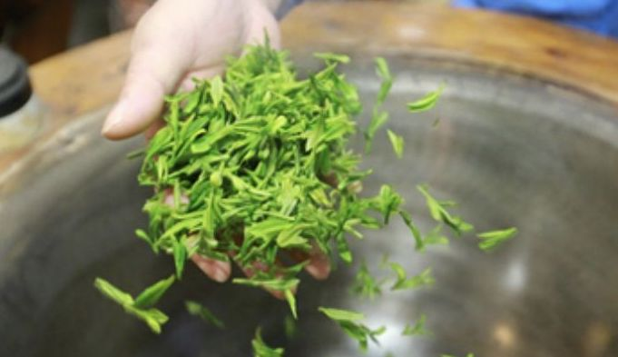
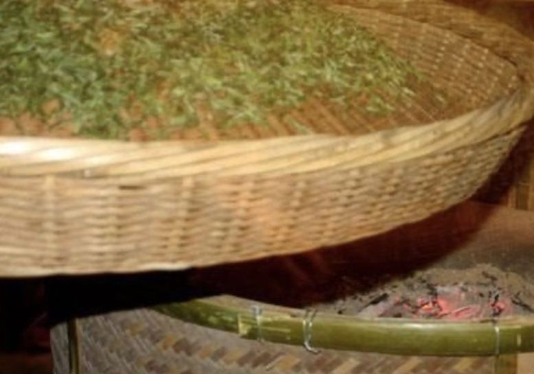
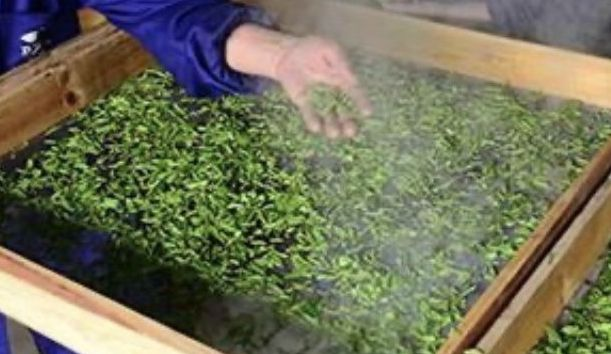
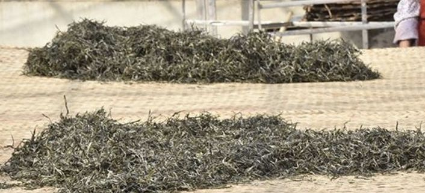

茶 - Tea

https://zhuanlan.zhihu.com/p/67724496

[TOC]

## 茶分类

> 到了今天，中国茶类的划分有多种方法，公认的是 **根据制作方法** 和 **茶多酚氧化（发酵）程度** 的不同，可分为六大类：
>
> * 绿茶（不发酵）（green tea）
> * 白茶（轻微发酵）（white tea）
> * 黄茶（轻发酵）（yellow tea）
> * 青茶（也叫乌龙茶、半发酵）（oolong tea）
> * 黑茶（后发酵）（dark tea）
> * 红茶（全发酵）（black tea）
>

## 十大名茶

* 中国十大名茶由1959年全国“十大名茶”评比会评选，包括西湖龙井，洞庭碧螺春，黄山毛峰，庐山云雾茶，六安瓜片，君山银针，信阳毛尖，武夷岩茶，安溪铁观音，祁门红茶。（顺序是有先后讲究的）

* 1915年巴拿马万国博览会将碧螺春、信阳毛尖、西湖龙井、君山银针、黄山毛峰、武夷岩茶、祁门红茶、都匀毛尖、铁观音、六安瓜片列为中国十大名茶。

* 1982年6月10日至16日在湖南长沙召开了全国名茶评选会，会议评选出全国名茶三十个，并对发展名茶生产提高茶叶质量提出了意见。

* 1999年《解放日报》将江苏碧螺春、西湖龙井、安徽毛峰、安徽瓜片、恩施玉露、福建铁观音、福建银针、云南普洱茶、福建岩茶、江西云雾茶列为中国十大名茶。

* 2001年美联社和《纽约日报》将黄山毛峰、洞庭碧螺春、蒙顶甘露、信阳毛尖、西湖龙井、都匀毛尖、庐山云雾、安徽瓜片、安溪铁观音、苏州茉莉花列为中国十大名茶。

* 2002年《香港文汇报》将西湖龙井、江苏碧螺春、安徽毛峰、福建银针、信阳毛尖、安徽祁门红、安徽瓜片、都匀毛尖、武夷岩茶、福建铁观音列为中国十大名茶。

## 水

水有天水，地水，软水，硬水等区别，选择好水才能泡出好茶。

* 天水

    在茶道中，大自然的雨水，雪水，露水等被称为天水，自古以来就是泡茶的上乘之水。唐代大诗人白居易有“融雪煎香茗”美句，《红楼梦》中也描述了用落在梅花上的雪水泡茶的韵味。但古时大气没受到污染，雨水，雪水要比现代洁净得多，因此现在用雨水，雪水煮水烹茶已经不太适宜了。

* 地水

    指的是山泉水，溪水，江河湖海水，地下水等。茶圣陆羽曾在《茶经》中指出：“其水，用山水上，江水中，井水下。其山水，拣乳泉，石池浸流者上；其江水，取去人远者。”陆羽认为，山泉水是最适合泡茶的美水，“泉自石出清宜洌”，山泉水含有益于人体的无机盐，为水中上品。

    江河湖海水等均为地表水，因长年流动，所含无机盐不多，受污染较重而不适宜沏茶，只有远离人烟，污染物较少的江河湖海水经过澄清后才可作为泡茶好水。但现在水污染情况较为严重，大部分江河水及地下水都易受周围环境污染，用来沏茶恐有损茶味。

* 软水

    所谓软水，是指每1000毫升水中钙离子和镁离子的含量不到10毫克。科学分析证明，一般在无污染的情况下，自然界中只有雪水，雨水和露水（即天水）才称得上是天然软水。软水中含其他溶质少，茶叶有效成分的溶解度高，故茶味浓，汤色清明，香气高雅，滋味鲜爽。

* 硬水

    所谓硬水，是指每1000毫升水中钙离子和镁离子的含量不超过了10毫克，江水，河水，湖水和井水等都属于硬水。硬水中含有较多的钙离子，镁离子和无机盐，茶叶有效成分的溶解度低，茶味变淡或变苦涩，所以泡茶效果就会差些。

* 酸性水与碱性水

    只有弱酸性水才最适合泡茶，而且，没有哪种茶汤是碱性的。茶叶泡出的茶汤都是酸性的，如绿茶PH约为6，红茶，普洱茶PH为4.6－4.9。若用碱性水泡茶，水中的碱会使茶叶中的茶多酚分解，使茶色变深，若用酸性水泡茶，会破坏茶叶中茶红素，使茶变黑。中国人几千年来养成的良好饮茶习惯证明，饮用弱酸性水冲泡的茶有益于养生保健，益寿延年。

泡茶时若要体现出茶的真味，唯有佳茗配美泉，现代茶道认为，具备“清，轻，甘，洌，活”等五项指标的水，才称得上宜茶美水。

* 清：水清则无杂，无色，透明，无沉淀物，才能体现茶汤本色。
* 轻：各种金属无机盐都可导致茶汤滋味或浓或淡，甚至含有毒性。水的比重越大，溶解的无机盐越多，所以水以轻为美。
* 甘：水入口后，舌尖立时感觉甜滋滋，吞咽下去，喉中也觉甜爽，用这样的水泡茶，品后会顿感甘甜。
* 洌：古人有“洌则茶味独全”的说法，寒洌之水多源于地层深处的泉脉之中，未被污染，泡出的茶汤滋味更纯正。
* 活：流水不腐，细菌不易繁殖，且其中的氧气和二氧化碳等气体含量较高，因而泡出的茶汤特别鲜爽可口。

## 绿茶篇

https://zhuanlan.zhihu.com/p/350400170

### 名茶

比较有名的绿茶有西湖龙井、碧螺春、信阳毛尖、六安瓜片、蒙顶甘露、黄山毛峰。

### 制作工艺

绿茶制作工艺有四种，根据杀青方式和最终干燥方式的不同，分别为：**炒青绿茶、烘青绿茶、蒸青绿茶、晒青绿茶**。

* 炒青绿茶

    * 炒青绿茶是指采用滚筒或锅炒的方式杀青、干燥而成的绿茶，外形紧结、色泽绿润、香气高鲜、汤色绿眀，滋味浓而爽口。炒青绿茶是绿茶中产量最庞大的，还可以细分为长炒青、圆炒青、扁炒青等。

    * 代表性名茶：西湖龙井、碧螺春、六安瓜片、信阳毛尖等。

        

* 烘青绿茶

    * 烘青绿茶是指在干燥过程中，用烘笼或烘干机烘干的绿茶，其外形完整、色泽深绿油润、香气清高、汤色清澈明亮、滋味鲜醇。

    * 代表性名茶：黄山毛峰、太平猴魁、峨眉毛峰等。

        

* 蒸青绿茶

    * 蒸青绿茶是中国绿茶最早的工艺，利用热蒸汽来对鲜叶进行杀青，再经揉捻、干燥。蒸青绿茶外形紧细呈针状，色泽鲜绿或深绿油润有光，汤色澄清，呈浅黄绿色，有清香，滋味醇或略涩。我国蒸青绿茶生产量较少，主要品种有恩施玉露，中国煎茶以及台湾部分茶区产品等。

    * 主要品种有恩施玉露，中国煎茶以及台湾部分茶区产品等。

        

* 晒青绿茶

    * 晒青绿茶是用日光进行干燥的绿茶，外形粗大，色泽深绿尚油润，香气高，汤色黄绿明亮，滋味浓尚醇，收敛性强，分布在湖南、湖北、广东、广西、四川，云南、贵州等省有少量生产，以云南大叶种的品质最好，称为“滇青”，不过大都被用作紧压茶的原料了。

    

### 功效 

（1）有助于延缓衰老。茶多酚具有很强的抗氧化性和生理活性，是人体自由基的清除剂。

（2）有助于抑制心血管疾病。 茶多酚对人体脂肪代谢有着重要作用。

（3）有助于预防和抗癌。 茶多酚可以阻断亚硝酸铵等多种致癌物质在体内合成，并具有直接杀伤癌细胞和提高肌体免疫能力的功效。据有关资料显示，茶叶中的茶多酚（主要是儿茶素类化合物），对胃癌、肠癌等多种癌症的预防和辅助治疗，均有裨益。

（4）有助于预防和治疗辐射伤害。 茶多酚及其氧化产物具有吸收放射性物质锶90和钴60毒害的能力。

（5）有助于抑制和抵抗病毒菌。 茶多酚有较强的收敛作用，对病原菌、病毒有明显的抑制和杀灭作用，对消炎止泻有明显效果。

（6）有助于美容护肤。 茶多酚是水溶性物质，用它洗脸能清除面部的油腻，收敛毛孔，具有消毒、灭菌、抗皮肤老化，减少日光中的紫外线辐射对皮肤的损伤等功效。

（7）有助于醒脑提神。 茶叶中的咖啡碱能促使人体中枢神经兴奋，增强大脑皮层的兴奋过程，起到提神益思、清心的效果。

（8）有助于利尿解乏。 茶叶中的咖啡碱可刺激肾脏，促使尿液迅速排出体外，提高肾脏的滤出率，减少有害物质在肾脏中滞留时间。咖啡碱还可排除尿液中的过量乳酸，有助于使人体尽快消除疲劳。

（9）有助于降脂助消化。

（10）有助于护齿明目。

### 禁忌

（1）不喝头遍茶：因为茶叶在栽培与加工过程中受到农药等有害物的污染，茶叶表面总有一定的残留，所以，头遍茶有洗涤作用应弃之不喝。

（2）空腹喝茶：空腹喝茶可稀释胃液，降低消化功能，加水吸收率高，致使茶叶中不良成分大量入血，引发头晕、心慌、四肢举动无力等症状。

（3）喜喝新茶：因为新茶存放时间短，含有较多的未经氧化的多酚类、醛类及醇类等物质，对人的胃肠黏膜有较强的刺激作用，易诱发胃病。所以新茶宜少喝，存放不足半个月的新茶更应忌喝。

（4）胃寒的人不宜过多饮，过量会引起肠胃不适。神经衰弱者和失眠症者临睡前不宜饮茶，正在哺乳的妇女也要少饮茶，由于茶对乳汁有收敛作用。

（5）忌用绿茶服药，忌喝隔夜茶。绿茶中的鞣酸会与很多药物结合产生沉淀，阻碍吸收，影响药效，俗话说：茶水可解药性。隔夜茶时间过久，维生素已丧失，而且茶里的营养成分会成为细菌、霉菌繁殖的养料。

（6）饭后不宜立即喝茶

（7）女性经期不宜饮用

（8）茶凉后不宜饮用

### 绿茶存储

1、 不宜将茶叶暴露再潮湿、高温、阳光中

2、 不宜将茶叶与其他有异味物品共存

3、 可用密封袋、瓷器、铝罐等工具密封存储

4、 可置于冰箱中低温冷藏

有人说绿茶不喝新茶，但其实绿茶就是要新茶，绿茶的保质期短，不像白茶普洱一类，越藏越有价值，绿茶常温密封下保质期也不过两年，大多数存储也都是冷藏，但冷藏拿出来后不及时饮用，基本就废了。

## 白茶篇

### 功效

### 禁忌

## 黄茶篇

### 功效

（1）黄茶是沤茶，在沤的过程中，会产生大量的消化酶，对脾胃最有好处，消化不良，食欲不振、懒动肥胖、都可饮而化之。

（2）纳米黄茶能更好发挥黄茶原茶的功能，纳米黄茶更能穿入脂肪细胞，使脂肪细胞在消化酶的作用下恢复代谢功能，将脂肪化除。

（3）黄茶茶根的利用是用来按摩二扇门（无名指本节处）能使微量元素透入穴位，增强穴位磁场产生调节作用，增加脂肪代谢。

（4）黄茶中富含茶多酚、氨基酸、可溶糖、维生素等丰富营养物质，对防治食道癌有明显功效。

（5）此外，黄茶鲜叶中天然物质保留有85%以上，而这些物质对防癌、抗癌、杀菌、消炎均有特殊效果，为其他茶叶所不及。

### 禁忌

（1）缺铁性贫血者：茶中的鞣酸会影响身体对铁的吸收，使贫血加重。

（2）神经衰弱者：茶中的咖啡因能使人兴奋，引起基础代谢增高，加重失眠。

（3）动性胃溃疡患者：咖啡因刺激胃液分泌，加重病情，影响溃疡愈合。

（4）泌尿系结石者：茶中的草酸会导致结石增多。

（5）肝功能不良者：咖啡因绝大部分经肝脏代谢，肝功能不良的人饮茶，将增加肝脏负担。

（6）便秘者：鞣酦有收敛作用，能减弱肠管蠕动，加重便秘。

（7）哺乳期妇女：咖啡因可通过乳汁进入婴儿体内，使婴儿发生肠痉挛，贫血，还会影响孩子的睡眠。

（8）心脏病者：饮茶过多，会使心跳加快，有的还可出现心律不齐。

（9）孕妇：饮茶过多，会使婴儿瘦小体弱。

（10）醉酒者：酒精对心血管刺激很大，咖啡因可使心跳加快，两者一起发挥作用，对心脏功能欠佳者，十分危险。

## 青茶（乌龙茶）篇

### 功效

### 禁忌

## 黑茶篇

### 功效

### 禁忌

## 红茶篇

### 功效

### 禁忌
